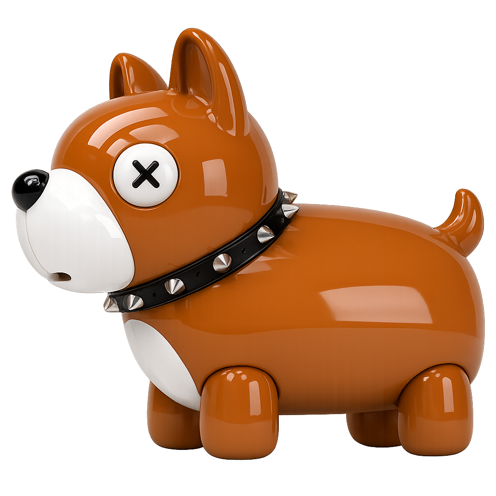

<div align="center">



<h1>sockguard</h1>

**Control what gets through. A security-first Docker socket proxy built in Go.**

</div>

<p align="center">
  <a href="https://github.com/CodesWhat/sockguard/releases"></a>
  <a href="https://github.com/CodesWhat/sockguard/pkgs/container/sockguard"></a>
  <a href="https://hub.docker.com/r/codeswhat/sockguard"></a>
  <a href="https://quay.io/repository/codeswhat/sockguard"></a>
  <br>
  <a href="https://github.com/orgs/CodesWhat/packages/container/package/sockguard"></a>
  <a href="https://github.com/orgs/CodesWhat/packages/container/package/sockguard"></a>
  <a href="LICENSE"></a>
</p>

<p align="center">
  <a href="https://github.com/CodesWhat/sockguard/stargazers"></a>
  <a href="https://github.com/CodesWhat/sockguard/forks"></a>
  <a href="https://github.com/CodesWhat/sockguard/issues"></a>
  <a href="https://github.com/CodesWhat/sockguard/commits/main"></a>
  <a href="https://github.com/CodesWhat/sockguard/commits/main"></a>
  <br>
  <a href="https://github.com/CodesWhat/sockguard/discussions"></a>
  <a href="https://github.com/CodesWhat/sockguard"></a>
</p>

<p align="center">
  <a href="https://github.com/CodesWhat/sockguard/actions/workflows/ci-verify.yml"></a>
  <a href="https://goreportcard.com/report/github.com/CodesWhat/sockguard"></a>
  <a href="https://pkg.go.dev/github.com/CodesWhat/sockguard"></a>
  <br>
  <a href="https://securityscorecards.dev/viewer/?uri=github.com/CodesWhat/sockguard"></a>
</p>

<hr>

<h2 align="center">📑 Contents</h2>

- [📖 Documentation](https://getsockguard.com/docs)
- [🌐 Website](https://getsockguard.com)
- [🚀 Quick Start](#quick-start)
- [🤔 Why Sockguard](#why-sockguard)
- [✨ Features](#features)
- [⚖️ Comparison](#comparison)
- [⚙️ Configuration](#configuration)
- [🔧 CLI](#cli)
- [🔄 Migrating from Tecnativa](#migrating-from-tecnativa)
- [🗺️ Roadmap](#roadmap)
- [🛠️ Built With](#built-with)
- [🤝 Contributing](#contributing)
- [🔒 Security](#security)

<hr>

> [!WARNING]
> **Pre-release software.** Sockguard is in active development. APIs, rule formats, and CLI flags may change before v1.0.

<h2 align="center" id="quick-start">🚀 Quick Start</h2>

Drop sockguard in front of any Docker API consumer. The proxy filters requests, your app stays unchanged.

```yaml
# docker-compose.yml
services:
  sockguard:
    image: codeswhat/sockguard:latest
    restart: unless-stopped
    read_only: true
    cap_drop:
      - ALL
    security_opt:
      - no-new-privileges:true
    volumes:
      - /var/run/docker.sock:/var/run/docker.sock:ro
    environment:
      - SOCKGUARD_LISTEN_ADDRESS=:2375
      - SOCKGUARD_LISTEN_INSECURE_ALLOW_PLAIN_TCP=true
      - SOCKGUARD_INSECURE_ALLOW_READ_EXFILTRATION=true
      - CONTAINERS=1
      - IMAGES=1
      - EVENTS=1

  # Your app talks to tcp://sockguard:2375 over the compose network
  # instead of mounting /var/run/docker.sock.
  drydock:
    image: codeswhat/drydock:latest
    depends_on:
      - sockguard
    environment:
      - DD_WATCHER_LOCAL_SOCKET=tcp://sockguard:2375
```

By default sockguard listens on loopback TCP `127.0.0.1:2375`, not on all interfaces. Non-loopback TCP now requires mutual TLS via `listen.tls` by default.

The compose example above opts into **legacy plaintext TCP** with `SOCKGUARD_LISTEN_INSECURE_ALLOW_PLAIN_TCP=true` so migration from `tecnativa/docker-socket-proxy` and `linuxserver/socket-proxy` still works on a private Docker network. It also opts into `SOCKGUARD_INSECURE_ALLOW_READ_EXFILTRATION=true` because broad `CONTAINERS=1` / `IMAGES=1` compatibility includes raw archive/export and log/attach streaming endpoints. Do not publish that plaintext listener to the host or Internet, and remove the read-exfil opt-in once you migrate to tighter YAML list/inspect rules.

If you run sockguard directly on a host, keep `SOCKGUARD_LISTEN_ADDRESS=127.0.0.1:2375`, configure `listen.tls` for remote TCP, or switch to `SOCKGUARD_LISTEN_SOCKET` to avoid a network listener entirely.

<details>
<summary>Container runtime hardening</summary>

Sockguard runs as root inside the container by default so it can open `/var/run/docker.sock` on stock Docker hosts without `user` or `group_add` overrides. For this class of tool, the meaningful hardening levers are the proxy policy, a read-only root filesystem, dropped capabilities, `no-new-privileges`, and the host runtime's seccomp/AppArmor/SELinux confinement.

The examples in this README already opt into the container-level controls sockguard actually benefits from:

- `read_only: true`
- `cap_drop: [ALL]`
- `security_opt: ["no-new-privileges:true"]`

Keep Docker's default seccomp profile or replace it with a stricter custom profile via `security_opt`. On AppArmor or SELinux hosts, keep the runtime's default confinement enabled or replace it with a stricter host policy. If the host runs rootless dockerd, a compromised Docker API client inherits the daemon's reduced authority instead of full host root.

</details>

<details>
<summary>mTLS TCP mode (recommended for remote TCP)</summary>

```yaml
services:
  sockguard:
    image: codeswhat/sockguard:latest
    restart: unless-stopped
    read_only: true
    cap_drop:
      - ALL
    security_opt:
      - no-new-privileges:true
    volumes:
      - /var/run/docker.sock:/var/run/docker.sock:ro
      - ./certs:/certs:ro
    environment:
      - SOCKGUARD_LISTEN_ADDRESS=:2376
      - SOCKGUARD_LISTEN_TLS_CERT_FILE=/certs/server-cert.pem
      - SOCKGUARD_LISTEN_TLS_KEY_FILE=/certs/server-key.pem
      - SOCKGUARD_LISTEN_TLS_CLIENT_CA_FILE=/certs/client-ca.pem
      - SOCKGUARD_INSECURE_ALLOW_READ_EXFILTRATION=true
      - CONTAINERS=1
```

Non-loopback TCP without `listen.tls` fails startup unless you explicitly set `SOCKGUARD_LISTEN_INSECURE_ALLOW_PLAIN_TCP=true`.
Sockguard's server-side TLS minimum for `listen.tls` is TLS 1.3, so remote clients must support TLS 1.3.
If one client CA issues multiple workloads, narrow the trusted set further in YAML with `listen.tls.allowed_common_names`, `allowed_dns_names`, `allowed_ip_addresses`, `allowed_uri_sans`, and/or `allowed_public_key_sha256_pins` so any CA-issued client cert is not automatically accepted.

</details>

<details>
<summary>Unix socket mode (filesystem-bounded access)</summary>

If you prefer to expose sockguard as a unix socket (no network surface at all), opt in by setting `SOCKGUARD_LISTEN_SOCKET` and sharing the socket via a named volume:

```yaml
services:
  sockguard:
    image: codeswhat/sockguard:latest
    read_only: true
    cap_drop:
      - ALL
    security_opt:
      - no-new-privileges:true
    volumes:
      - /var/run/docker.sock:/var/run/docker.sock:ro
      - sockguard-socket:/var/run/sockguard
    environment:
      - SOCKGUARD_LISTEN_SOCKET=/var/run/sockguard/sockguard.sock
      - SOCKGUARD_INSECURE_ALLOW_READ_EXFILTRATION=true
      - CONTAINERS=1

  drydock:
    image: codeswhat/drydock:latest
    depends_on:
      - sockguard
    volumes:
      - sockguard-socket:/var/run/sockguard:ro
    environment:
      - DD_WATCHER_LOCAL_SOCKET=/var/run/sockguard/sockguard.sock

volumes:
  sockguard-socket:
```

Sockguard hardens its own unix socket to `0600` owner-only permissions. `listen.socket_mode` remains in the config surface as a guardrail and must stay `0600`; broader modes are rejected at startup instead of being applied.

To run fully unprivileged with a unix socket, pre-create a host directory with the uid/gid you want and bind-mount it in place of the named volume.

</details>

<hr>

<h2 align="center" id="why-sockguard">🤔 Why Sockguard</h2>

The Docker socket is **root access to your host**. Every container with socket access can escape containment, mount the host filesystem, and pivot to other containers. Yet tools like Traefik, Portainer, and drydock need socket access to function.

Most existing socket proxies stop at method/path or regex filtering. Tecnativa and LinuxServer gate broad Docker API sections, and wollomatic adds regex allowlists, hostname/IP admission, per-container label allowlists, optional bind-mount restrictions, JSON logging, and a filtered unix-socket endpoint. Sockguard goes further on body-aware policy enforcement, per-client profile selection, ownership isolation, and read-side visibility/redaction.

<hr>

<h2 align="center" id="features">✨ Features</h2>

| | Feature | Description |
|---|---|---|
| 🛡️ | **Default-Deny Posture** | Everything blocked unless explicitly allowed. No match means deny. |
| 🎛️ | **Granular Control** | Allow start/stop while blocking create/exec. Per-operation POST controls with glob matching. |
| 📋 | **YAML Configuration** | Declarative rules, glob path patterns, first-match-wins evaluation, and canonical path matching that strips API versions, collapses dot segments, and decodes escaped separators before policy evaluation. 10 bundled presets. |
| 📊 | **Structured Access Logging** | JSON access logs with method, raw path, normalized path, decision, matched rule, latency, canonical request ID, and client info. Use `normalized_path` for SIEM correlation and policy analysis; raw `path` is preserved for forensic replay. Canonical request IDs are generated from a buffered pool so request logging does not block on a fresh entropy read per request. |
| 🔐 | **mTLS for Remote TCP** | Non-loopback TCP listeners require mutual TLS by default. Plaintext TCP is explicit legacy mode only. |
| 🌐 | **Client ACL Primitives** | Optional source-CIDR admission checks, client-container label ACLs, certificate selectors, and unix peer credentials let one proxy differentiate callers before the global rule set runs. When mTLS is enabled, certificate selectors follow the verified client leaf certificate rather than an unverified peer slice entry. |
| 🗃️ | **Bounded Inspect Cache** | Ownership and visibility checks reuse a short-lived singleflight cache for upstream Docker inspect metadata so bursts of repeated reads do not fan out into duplicate synchronous inspect calls. |
| 🔍 | **Request Body Inspection** | `POST /containers/create`, `/containers/*/exec`, `/exec/*/start`, `/images/create`, `/build`, `/volumes/create`, `/secrets/create`, `/configs/create`, `/services/create`, `/services/*/update`, `/swarm/init`, `/swarm/join`, `/swarm/update`, `/plugins/pull`, `/plugins/*/upgrade`, `/plugins/*/set`, and `/plugins/create` are inspected to block privileged or host-bound workloads, non-allowlisted mounts/devices/commands/remotes, unsafe swarm bootstrap or rotation changes, and remote build contexts before Docker sees the request. `POST /plugins/create` is inspected whether the tar upload arrives as a raw body or `multipart/form-data`. Oversized bounded bodies on `/containers/create`, `/volumes/create`, `/secrets/create`, `/configs/create`, and `/plugins/create` are rejected with `413 Payload Too Large` before any upstream call. These inspectors intentionally decode the policy-relevant subset of Docker's schema and still defer full-schema validation to Docker itself. |
| 🏷️ | **Owner Label Isolation** | A proxy instance can stamp label-capable creates plus build-produced images with an owner label, auto-filter labeled list/prune/events calls, and deny cross-owner access across containers, images, networks, volumes, services, tasks, secrets, and configs. |
| 🫥 | **Visibility-Controlled Reads** | Redacts env, mount, network, config, plugin, and swarm-sensitive metadata by default, can hide labeled list/inspect/log reads behind per-client visibility rules, and keeps raw archive/export and stream-style reads behind explicit opt-in. |
| 🧱 | **Body-Blind Write Guardrail** | Any remaining write Sockguard cannot safely constrain stays behind explicit `insecure_allow_body_blind_writes` opt-in instead of being silently exposed. Today that guardrail chiefly covers arbitrary exec without `request_body.exec.allowed_commands`, plus other body-bearing control-plane writes that still lack dedicated inspectors. |
| 🔄 | **Tecnativa Compatible** | Drop-in replacement for the current Tecnativa env surface, including section vars, `ALLOW_RESTARTS`, `SOCKET_PATH`, and `LOG_LEVEL`. |
| 🪶 | **Minimal Attack Surface** | Wolfi-based image. Cosign-signed with SBOM and build provenance. |
| ⚡ | **Streaming-Safe** | Preserves Docker streaming endpoints (logs, attach, events) without breaking timeouts, while reaping idle TCP keep-alive connections after 120s. |
| 🩺 | **Health Check** | `/health` endpoint with cached upstream reachability probes. |
| 🧪 | **Battle-Tested** | ~99% statement coverage, race-detector clean, monthly Gremlins mutation testing, and fuzz testing on filter, config, proxy, and hijack paths. |

<hr>

<h2 align="center" id="comparison">⚖️ Comparison</h2>

How sockguard stacks up against other Docker socket proxies:

| Feature | Tecnativa | LinuxServer | wollomatic | **Sockguard** |
|---------|:---------:|:-----------:|:----------:|:-------------:|
| Method + path filtering | ✅ | ✅ | ✅ (regex) | ✅ |
| Granular container write ops | ❌ | Partial (`ALLOW_*`) | Via regex | ✅ |
| Request body inspection | ❌ | ❌ | Partial (bind-mount source restrictions) | ✅ (`create`, `exec`, `volume`, `secret`, `config`, `service`, `swarm`, `plugin`, `pull`, `build`) |
| Per-client admission / policy selection | ❌ | ❌ | Partial (IP/hostname + per-container labels) | ✅ (CIDR + labels + cert selectors + unix peer profiles) |
| Read-side visibility / redaction | ❌ | ❌ | ❌ | ✅ (visibility + expanded redaction) |
| Structured access logs | ❌ | ❌ | ✅ (JSON option) | ✅ |
| Dedicated audit log schema | ❌ | ❌ | ❌ | ✅ (JSON schema + reason codes) |
| YAML config | ❌ | ❌ | ❌ | ✅ |
| Tecnativa env compat | N/A | ✅ | ❌ | ✅ |

Wollomatic deserves more credit than earlier versions of this README gave it. Current releases already support hostname/IP admission, per-container label allowlists, optional bind-mount restrictions, JSON logging, and a filtered unix-socket endpoint. Sockguard's current lead is in exec/pull/build inspection, named profiles, ownership isolation, and read-side visibility/redaction.

<hr>

<h2 align="center" id="configuration">⚙️ Configuration</h2>

### Environment Variables (Tecnativa-compatible)

```bash
CONTAINERS=1    # Allow /containers/** (GET/HEAD when POST=0)
IMAGES=0        # Deny /images/**
SERVICES=1      # Allow /services/** (GET/HEAD when POST=0)
EVENTS=1        # Allow /events (default)
POST=0          # Read-only mode

# Granular container writes still work even when POST=0
ALLOW_START=1
ALLOW_STOP=1
ALLOW_RESTARTS=1

# Compat aliases
SOCKET_PATH=/var/run/docker.sock
LOG_LEVEL=warning
```

Compat env vars only generate rules when no explicit `rules:` are configured. If you provide `rules:` in YAML, those rules win even when they happen to match the built-in defaults exactly.

Broad compat reads such as `CONTAINERS=1`, `IMAGES=1`, or `POST=0` with section-wide `GET` access now require `SOCKGUARD_INSECURE_ALLOW_READ_EXFILTRATION=true` if you intentionally want raw archive/export or log/attach streaming parity. Safer YAML configs should allow only the list/inspect endpoints a client actually needs.

### YAML Config (recommended)

```yaml
listen:
  address: 127.0.0.1:2375
  insecure_allow_plain_tcp: false
  tls:
    cert_file: /run/secrets/sockguard/server-cert.pem
    key_file: /run/secrets/sockguard/server-key.pem
    client_ca_file: /run/secrets/sockguard/client-ca.pem
    allowed_dns_names:
      - portainer.internal
    allowed_uri_sans:
      - spiffe://sockguard.test/workload/portainer

insecure_allow_body_blind_writes: false
insecure_allow_read_exfiltration: false

response:
  deny_verbosity: minimal  # recommended for production; verbose adds method/path/reason for debugging
  redact_container_env: true
  redact_mount_paths: true
  redact_network_topology: true
  redact_sensitive_data: true

request_body:
  container_create:
    allowed_bind_mounts:
      - /srv/containers
      - /var/lib/app-data
  exec:
    allowed_commands:
      - ["/usr/local/bin/pre-update", "--check"]
  image_pull:
    allow_official: true
    allowed_registries:
      - ghcr.io
  build:
    allow_remote_context: false
    allow_host_network: false
    allow_run_instructions: false
  service:
    allow_host_network: false
    allowed_bind_mounts:
      - /srv/services
    allow_official: true
    allowed_registries:
      - ghcr.io
  swarm:
    allow_force_new_cluster: false
    allow_external_ca: false

clients:
  allowed_cidrs:
    - 172.18.0.0/16
  container_labels:
    enabled: true
    label_prefix: com.sockguard.allow.

ownership:
  owner: ci-job-123
  label_key: com.sockguard.owner

rules:
  - match: { method: GET, path: "/_ping" }
    action: allow
  - match: { method: GET, path: "/containers/json" }
    action: allow

  - match: { method: GET, path: "/containers/*/json" }
    action: allow
  - match: { method: POST, path: "/containers/*/start" }
    action: allow
  - match: { method: "*", path: "/**" }
    action: deny
```

Trailing `/**` matches both the base path and any deeper path. For example, `/containers/**` matches `/containers` and `/containers/abc/json`.

`listen.tls` is only needed when you expose Sockguard on non-loopback TCP. Plaintext non-loopback TCP is rejected unless you set `listen.insecure_allow_plain_tcp: true`, which is intended only for legacy compatibility on a private, trusted network. `listen.tls.client_ca_file` still defines the issuing trust root, and the optional `listen.tls.allowed_common_names`, `allowed_dns_names`, `allowed_ip_addresses`, `allowed_uri_sans`, and `allowed_public_key_sha256_pins` fields let you narrow that trust to specific verified client leaves. Different selector fields are ANDed, while entries inside one field are ORed.

Allowed `POST /containers/create` requests are inspected by default. Unless you opt out, Sockguard blocks `HostConfig.Privileged=true`, `HostConfig.NetworkMode=host`, and any bind mount source outside `request_body.container_create.allowed_bind_mounts`. Named volumes still work without allowlist entries because they are not host bind mounts.

Allowed `POST /containers/*/exec` and `POST /exec/*/start` requests are inspected when `request_body.exec.allowed_commands` is non-empty. Sockguard denies non-allowlisted argv vectors, denies privileged execs unless `request_body.exec.allow_privileged: true`, denies root-user execs unless `request_body.exec.allow_root_user: true`, and re-inspects `POST /exec/*/start` against Docker's stored exec metadata before letting it run.

That exec-start re-check is a best-effort guard, not an atomic Docker primitive. Docker exposes exec inspect and exec start as separate API calls, so there is an unavoidable time-of-check/time-of-use window between Sockguard reading the stored exec metadata and forwarding the start request. Keep exec rules narrow, require an `allowed_commands` allowlist, and avoid broad profile assignments for clients that should not be able to create or start arbitrary exec sessions.

Allowed `POST /images/create` requests are inspected by default. Sockguard denies `fromSrc` image imports unless `request_body.image_pull.allow_imports: true` and only allows Docker Hub official images unless you set `request_body.image_pull.allow_all_registries: true` or list explicit `request_body.image_pull.allowed_registries`.

Allowed `POST /build` requests are inspected by default. Sockguard denies remote build contexts, `networkmode=host`, and Dockerfiles containing `RUN` instructions unless you explicitly allow those behaviors under `request_body.build.*`.

Allowed `POST /services/create` and `POST /services/*/update` requests are inspected by default. Sockguard denies services that attach the `host` network, denies bind mounts outside `request_body.service.allowed_bind_mounts`, and constrains service images to Docker Hub official images unless you set `request_body.service.allow_all_registries: true` or list explicit `request_body.service.allowed_registries`.

Allowed `POST /swarm/init` requests are inspected by default. Sockguard denies `ForceNewCluster` and external CA configuration unless you explicitly allow them under `request_body.swarm.*`.

`clients.allowed_cidrs` is a coarse TCP-client gate. Requests whose source IP falls outside every configured CIDR are denied before `/health` or the global rule set runs.

When `clients.container_labels.enabled` is true, Sockguard resolves bridge-network callers by source IP through the Docker API and looks for per-client allow labels on the calling container. Each `clients.container_labels.label_prefix + <method>` label is interpreted as a comma-separated Sockguard glob allowlist for that HTTP method. For example, `com.sockguard.allow.get=/containers/json,/containers/*/json,/events` allows only container list/inspect reads plus `GET /events` for that client. If you are migrating from wollomatic, set `clients.container_labels.label_prefix: socket-proxy.allow.` to reuse existing labels.

For multi-consumer setups, define named client profiles and assign them by source IP, verified mTLS certificate selectors, or unix peer credentials. Root-level `rules` and `request_body` remain the fallback policy unless `clients.default_profile` points at one of the named profiles:

```yaml
clients:
  default_profile: readonly
  source_ip_profiles:
    - profile: watchtower
      cidrs:
        - 172.18.0.0/16
  client_certificate_profiles:
    - profile: portainer
      dns_names:
        - portainer.internal
      spiffe_ids:
        - spiffe://sockguard.test/workload/portainer
  unix_peer_profiles:
    - profile: readonly
      uids:
        - 501
  profiles:
    - name: readonly
      response:
        visible_resource_labels:
          - com.sockguard.visible=true
      rules:
        - match: { method: GET, path: "/containers/json" }
          action: allow
        - match: { method: GET, path: "/containers/*/json" }
          action: allow
        - match: { method: GET, path: "/events" }
          action: allow
        - match: { method: "*", path: "/**" }
          action: deny
    - name: watchtower
      response:
        visible_resource_labels:
          - com.sockguard.client=watchtower
      request_body:
        image_pull:
          allow_all_registries: true
        exec:
          allowed_commands:
            - ["/usr/local/bin/pre-update"]
      rules:
        - match: { method: GET, path: "/containers/json" }
          action: allow
        - match: { method: GET, path: "/containers/*/json" }
          action: allow
        - match: { method: POST, path: "/containers/*/exec" }
          action: allow
        - match: { method: POST, path: "/exec/*/start" }
          action: allow
        - match: { method: POST, path: "/images/create" }
          action: allow
        - match: { method: "*", path: "/**" }
          action: deny
```

`clients.source_ip_profiles` match the caller's remote IP against CIDRs in config order. `clients.client_certificate_profiles` match the verified mTLS leaf certificate in config order and can use `common_names`, `dns_names`, `ip_addresses`, `uri_sans`, and `spiffe_ids`. `clients.unix_peer_profiles` match unix-socket callers by peer `uids`, `gids`, and `pids`. Different selector fields on one assignment are ANDed, while entries within one field are ORed. `clients.default_profile` remains the fallback when no specific assignment matches.

Client-certificate profile assignment requires `listen.tls` mutual TLS, and unix-peer profile assignment requires `listen.socket`. Profile rules and request-body policies are compiled and validated at startup just like the root policy, and `sockguard validate` now prints the configured client-profile sections too.

`response.visible_resource_labels` and `clients.profiles[].response.visible_resource_labels` add read-side visibility control on top of allow rules. Sockguard injects those selectors into labeled list endpoints such as `GET /containers/json`, `/images/json`, `/networks`, `/volumes`, `/services`, `/tasks`, `/secrets`, `/configs`, `/nodes`, and `GET /events`, and returns `404` for hidden inspect/log-style reads such as `GET /containers/*/json`, `/images/*/json`, `/networks/*`, `/volumes/*`, `GET /exec/*/json`, `GET /services/*`, `GET /services/*/logs`, `GET /tasks/*`, `GET /tasks/*/logs`, `GET /secrets/*`, `GET /configs/*`, `GET /nodes/*`, and `GET /swarm`. Selectors use Docker label syntax (`key` or `key=value`), are ANDed together, and profile selectors are additive with the root response selectors. If the caller already supplied every required selector, Sockguard leaves the original `filters` query untouched instead of re-encoding it.

Set `ownership.owner` to turn on per-proxy resource ownership isolation. Sockguard will add `ownership.label_key=ownership.owner` labels to `POST /containers/create`, `/networks/create`, `/volumes/create`, `/services/create`, `/services/*/update`, `/secrets/create`, `/configs/create`, `/nodes/*/update`, and `/swarm/update`, add the same label to `POST /build`, inject owner label filters into list/prune/events requests including `/services`, `/tasks`, `/secrets`, `/configs`, and `/nodes` (using Docker's `node.label` filter key there), and deny direct access to owned containers, images, networks, volumes, services, tasks, secrets, configs, nodes, and swarm state from some other proxy identity. Service writes are stamped both at `Labels` and `TaskTemplate.ContainerSpec.Labels` so downstream tasks inherit the same owner identity. Unlabeled nodes and swarm state are fail-closed on reads once ownership is enabled, but they can still be claimed through `/nodes/*/update` and `/swarm/update` because Sockguard stamps the current owner label onto those update bodies before forwarding. Unowned images are still readable by default so shared base images can be pulled and inspected without relabeling.

`insecure_allow_body_blind_writes` is off by default. Validation still fails unless you explicitly set it to `true` when your rules allow body-sensitive writes Sockguard cannot safely constrain yet, chiefly arbitrary `POST /containers/*/exec` / `POST /exec/*/start` without a `request_body.exec.allowed_commands` allowlist.

`insecure_allow_read_exfiltration` is also off by default. Validation fails unless you explicitly set it to `true` when your rules allow raw archive/export or stream-oriented read surfaces such as `GET /containers/*/archive`, `GET /containers/*/export`, `GET /containers/*/logs`, `GET /containers/*/attach/ws`, `POST /containers/*/attach`, `GET /services/*/logs`, `GET /tasks/*/logs`, `GET /images/get`, or `GET /images/*/get`. The rule compiler only sees method + path, so `/containers/*/logs` is treated conservatively whether or not the caller also sets `follow=1`. This is mainly for full Tecnativa-style section parity or intentionally broad backup/export clients; most dashboards and controllers should allow only the specific list/inspect endpoints they need instead.

`response.deny_verbosity` defaults to `minimal` so `403` responses carry only a generic deny message and never leak the request method, path, or matched rule reason back to the caller. Set it to `verbose` explicitly during rule authoring if you need to see which rule denied a request — verbose is still useful in dev but should never run in production because it echoes request details in the response body. Even in `verbose` mode, Sockguard redacts denied `/secrets/*` and `/swarm/unlockkey` paths before returning them.

Access and audit logs deliberately preserve both raw and canonical path fields. In access logs, `path` is the raw client URL path and `normalized_path` is the policy path after Sockguard's canonicalization; in audit logs the same distinction is `raw_path` versus `normalized_path`. Use `normalized_path` for SIEM detections, dashboards, and allow/deny analysis. Treat raw `path`/`raw_path` as forensic context only, because a client can vary it with Docker API version prefixes, percent-encoding, or dot segments.

Audit events always include an `ownership` object. When `ownership.owner` is configured, that owner identifier appears in every audit event, not only resource ownership decisions, so use a non-secret tenant/workload label suitable for your audit sink.

`response.redact_container_env`, `response.redact_mount_paths`, `response.redact_network_topology`, and `response.redact_sensitive_data` all default to `true`. Sockguard now redacts workload env arrays across container/service/task/plugin reads, redacts host-path-bearing mount and device metadata across container/volume/task/service/plugin/system-usage reads, strips container/network/swarm/node topology from container/network/service/task/node/swarm/info/system-usage responses, and redacts higher-risk payload material such as config `Spec.Data`, service secret/config references, swarm join/unlock material, and swarm/node TLS metadata. Disable those toggles only for trusted admin clients that genuinely need raw Docker metadata.

Preset configs included for [drydock](app/configs/drydock.yaml), [Traefik](app/configs/traefik.yaml), [Portainer](app/configs/portainer.yaml), [Watchtower](app/configs/watchtower.yaml), [Homepage](app/configs/homepage.yaml), [Homarr](app/configs/homarr.yaml), [Diun](app/configs/diun.yaml), [Autoheal](app/configs/autoheal.yaml), and [read-only](app/configs/readonly.yaml).

<hr>

<h2 align="center" id="cli">🔧 CLI</h2>

```bash
sockguard serve                                     # Start proxy (default)
sockguard validate -c sockguard.yaml                # Validate + print compiled rule table
sockguard match -c sockguard.yaml -X GET --path /v1.45/containers/json
                                                    # Dry-run a single request through the rules
sockguard version                                   # Print version
```

`sockguard match` is the offline rule-evaluation probe — point it
at a config and a `<method, path>` and it prints which rule fires,
what the normalized path looks like, and the reason (if any), so
you can sanity-check a ruleset before any traffic hits the proxy.
Output is text by default or JSON via `-o json`.

<hr>

<h2 align="center" id="migrating-from-tecnativa">🔄 Migrating from Tecnativa</h2>

Replace the image — your current Tecnativa env surface maps over directly, with one explicit security acknowledgement for broad archive/export or log/attach streaming parity:

```diff
 services:
   socket-proxy:
-    image: tecnativa/docker-socket-proxy
+    image: codeswhat/sockguard
     volumes:
       - /var/run/docker.sock:/var/run/docker.sock:ro
     environment:
       - SOCKGUARD_LISTEN_ADDRESS=:2375
       - SOCKGUARD_LISTEN_INSECURE_ALLOW_PLAIN_TCP=true
       - SOCKGUARD_INSECURE_ALLOW_READ_EXFILTRATION=true
       - CONTAINERS=1
       - SERVICES=1
       - POST=0
```

<hr>

<h2 align="center" id="roadmap">🗺️ Roadmap</h2>

| Version | Theme | Status |
|---------|-------|--------|
| **0.1.0** | MVP — drop-in replacement with granular control, YAML config, structured access logging | ✅ shipped |
| **0.2.0** | mTLS for remote TCP, TLS 1.3 minimum, loopback-by-default listener, body-blind write guardrail | ✅ shipped |
| **0.3.0** | Body inspection for create/exec/service/swarm/pull/build, owner labels, per-client profiles, visibility/redaction | ✅ shipped |
| **0.4.0** | Hardening pass — canonical percent-decoded path matching, mTLS client admission selectors (CN/DNS/IP/URI SAN + SHA-256 SPKI pins), 413 on oversize bounded bodies, multipart plugin-create inspection, and profile-resolution memoization | ✅ shipped |
| **0.5.0** | Feature completion pass — SPKI profile selectors, remaining body-sensitive write inspectors, broader response-side controls, and Prometheus metrics | 🕒 planned |
| **0.6.0** | Secure container enforcement — readonly rootfs, non-root/no-new-privilege rails, resource limits, approved seccomp/AppArmor/SELinux, restricted CapAdd/Devices, image signatures plus attestations | 🕒 planned |
| **0.7.0** | Abuse controls — per-client rate limits, burst budgets, concurrency caps, expensive-endpoint quotas | 🕒 planned |
| **0.8.0** | Dynamic policy delivery — signed bundles, long-poll/hot reload, audit/warn/enforce rollout modes, admin API, policy versioning | 🕒 planned |

<hr>

<h2 align="center" id="built-with">🛠️ Built With</h2>

<p align="center">
  
  
  
  
  
  <br>
  
  
  
  
  
</p>

<hr>

<h2 align="center" id="contributing">🤝 Contributing</h2>

See [CONTRIBUTING.md](CONTRIBUTING.md). Issues, ideas, and pull requests welcome.

For local fuzz triage, run `scripts/local-fuzz.sh --suite ci --fuzztime 2m`. Use `--suite ultra` for every fuzzer, `--timeout` to set the Go watchdog explicitly, and `--docker --platform linux/amd64` when you want closer GitHub Actions parity.

<hr>

<h2 align="center" id="security">🔒 Security</h2>

- **Responsible disclosure** — see [SECURITY.md](SECURITY.md) for scope, supported versions, and how to report a vulnerability privately.
- **Image verification** — every release is cosign-signed via GitHub Actions OIDC. Before running a sockguard image in production, verify it with the canonical invocation in the [image verification guide](docs/src/content/verification.mdx).

<div align="center">

Built by <a href="https://codeswhat.com">CodesWhat</a> · Licensed under <a href="LICENSE">Apache-2.0</a>

</div>
