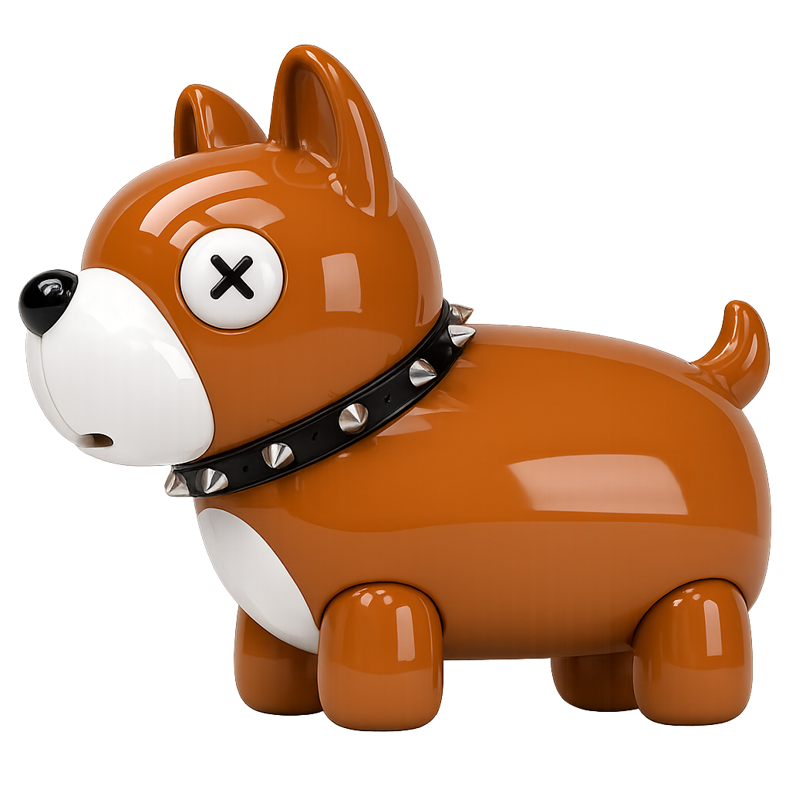
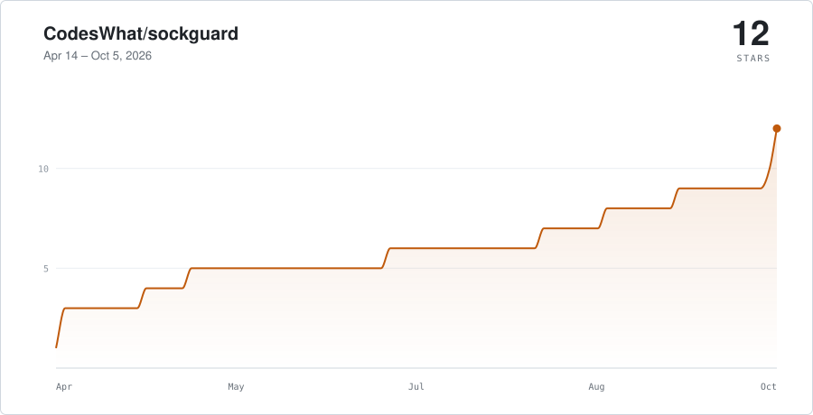

<div align="center">

<picture>
  <source media="(prefers-color-scheme: dark)" srcset="sockguard-logo-dark.png">
  
</picture>

<h1 id="sockguard">sockguard</h1>

**Control what gets through. A default-deny Docker socket proxy built in Go.**

</div>

<p align="center">
  <!-- row 1, identity -->
  <a href="https://github.com/CodesWhat/sockguard/releases"></a>
  <a href="https://github.com/orgs/CodesWhat/packages/container/package/sockguard"></a>
  <a href="https://github.com/orgs/CodesWhat/packages/container/package/sockguard"></a>
  <a href="LICENSE"></a>
  <br>
  <!-- row 2, quality/security -->
  <a href="https://github.com/CodesWhat/sockguard/actions/workflows/ci-verify.yml"></a>
  <a href="https://github.com/CodesWhat/sockguard/actions/workflows/quality-integration.yml"></a>
  <a href="https://github.com/CodesWhat/sockguard/actions/workflows/quality-fuzz-nightly.yml"></a>
  <a href="https://github.com/CodesWhat/sockguard/actions/workflows/security-grype.yml"></a>
  <a href="https://securityscorecards.dev/viewer/?uri=github.com/CodesWhat/sockguard"></a>
  <a href="https://www.bestpractices.dev/projects/14030"></a>
  <a href="https://qlty.sh/gh/CodesWhat/projects/sockguard"></a>
  <a href="https://qlty.sh/gh/CodesWhat/projects/sockguard"></a>
  <a href="https://github.com/CodesWhat/sockguard/actions/workflows/quality-mutation-monthly.yml"></a>
  <br>
  <!-- row 3, social proof -->
  <a href="https://github.com/CodesWhat/sockguard/releases"></a>
  <a href="https://github.com/CodesWhat/sockguard/pkgs/container/sockguard"></a>
  <a href="https://hub.docker.com/r/codeswhat/sockguard"></a>
  <a href="https://quay.io/repository/codeswhat/sockguard"></a>
  <a href="https://github.com/CodesWhat/sockguard/stargazers"></a>
  <a href="https://github.com/CodesWhat/sockguard/issues"></a>
  <a href="https://github.com/CodesWhat/sockguard/discussions"></a>
  <a href="https://github.com/sponsors/CodesWhat"></a>
</p>

<hr>

> [!NOTE]
> **v2.2.7 is the latest stable release.** It is a security patch on the v2.2 line for Podman compat creates and Dockerfile forms the RUN gate missed: on a Podman upstream, a Docker-compatible container create can no longer bind a host path past `allowed_bind_mounts` through a relative, empty, drive-letter or comma-injected mount field, and the RUN gate now recognises syntax directives written as `//` or JSON and RUN instructions that BuildKit assembles across continuations differently than Sockguard did. See [CHANGELOG.md](CHANGELOG.md) for the complete release notes.

<h2 align="center">Contents</h2>

- [Documentation](#documentation)
- [Quick Start](#quick-start)
- [Why Sockguard](#why-sockguard)
- [Features](#features)
- [Supported Profiles](#supported-profiles)
- [Feature Comparison](#feature-comparison)
- [Configuration](#configuration)
- [CLI](#cli)
- [Migration](#migration)
- [Roadmap](#roadmap)
- [Star History](#star-history)
- [Built With](#built-with)
- [Community & Support](#community-support)
- [CodesWhat Ecosystem](#codeswhat-ecosystem)

<hr>

<h2 align="center" id="documentation">Documentation</h2>

| Resource | Link |
| --- | --- |
| Website | [getsockguard.com](https://getsockguard.com/) |
| Docs | [getsockguard.com/docs](https://getsockguard.com/docs) |
| Getting Started | [Getting Started](https://getsockguard.com/docs/getting-started) |
| Configuration | [Configuration](https://getsockguard.com/docs/configuration) |
| Multi-Host | [Multi-Host](https://getsockguard.com/docs/multi-host) |
| Presets | [Presets](https://getsockguard.com/docs/presets) |
| Podman | [Podman](https://getsockguard.com/docs/podman) |
| Migration | [Migration](https://getsockguard.com/docs/migration) |
| Roadmap | See [Roadmap](#roadmap) section below, and the [docs roadmap](https://getsockguard.com/docs/roadmap) |
| CIS Docker Benchmark | [CIS Docker Benchmark](https://getsockguard.com/docs/cis-docker-benchmark) |
| Admin API | [Admin API](https://getsockguard.com/docs/admin) |
| Observability | [Observability](https://getsockguard.com/docs/observability) |
| Security Model | [Security Model](https://getsockguard.com/docs/security) |
| Image Verification | [Image Verification](https://getsockguard.com/docs/verification) |
| Changelog | [`CHANGELOG.md`](CHANGELOG.md) |
| Contributing | [`CONTRIBUTING.md`](CONTRIBUTING.md) |
| Code of Conduct | [`CODE_OF_CONDUCT.md`](CODE_OF_CONDUCT.md) |
| Governance | [`GOVERNANCE.md`](GOVERNANCE.md) |
| Security Assurance | [`SECURITY-ASSURANCE.md`](SECURITY-ASSURANCE.md) |
| Security Policy | [`SECURITY.md`](SECURITY.md) |
| Issues | [GitHub Issues](https://github.com/CodesWhat/sockguard/issues) |
| Discussions | [GitHub Discussions](https://github.com/CodesWhat/sockguard/discussions) |

<hr>

<h2 align="center" id="quick-start">Quick Start</h2>

Drop sockguard in front of any Docker API consumer. The proxy filters requests, your app stays unchanged.

```yaml
# docker-compose.yml
services:
  sockguard:
    image: codeswhat/sockguard:latest
    restart: unless-stopped
    read_only: true
    cap_drop:
      - ALL
    security_opt:
      - no-new-privileges:true
    group_add:
      - "${DOCKER_SOCK_GID:?set to the GID of /var/run/docker.sock}"
    volumes:
      - /var/run/docker.sock:/var/run/docker.sock:ro
    environment:
      - SOCKGUARD_LISTEN_ADDRESS=:2375
      - SOCKGUARD_LISTEN_INSECURE_ALLOW_PLAIN_TCP=true
      - SOCKGUARD_LISTEN_INSECURE_ALLOW_UNAUTHENTICATED_CLIENTS=true
      - SOCKGUARD_INSECURE_ALLOW_READ_EXFILTRATION=true
      - CONTAINERS=1
      - IMAGES=1
      - EVENTS=1

  # Your app talks to tcp://sockguard:2375 over the compose network
  # instead of mounting /var/run/docker.sock.
  drydock:
    image: codeswhat/drydock:latest
    depends_on:
      - sockguard
    environment:
      - DD_WATCHER_LOCAL_SOCKET=tcp://sockguard:2375
```

Before `docker compose up`, set `DOCKER_SOCK_GID` to the socket's numeric group owner (`export DOCKER_SOCK_GID=$(stat -c '%g' /var/run/docker.sock)` on Linux; use `stat -f '%g'` on macOS).

By default sockguard listens on loopback TCP `127.0.0.1:2375`, not on all interfaces. Non-loopback TCP now requires mutual TLS via `listen.tls` by default.

The compose example above opts into **legacy plaintext TCP** so migration from `tecnativa/docker-socket-proxy` and `linuxserver/socket-proxy` still works on a private Docker network. A non-loopback plaintext listener requires **two** deliberate acknowledgments — `SOCKGUARD_LISTEN_INSECURE_ALLOW_PLAIN_TCP=true` (unencrypted transport) and `SOCKGUARD_LISTEN_INSECURE_ALLOW_UNAUTHENTICATED_CLIENTS=true` (any host that can reach the port can impersonate a client) — so a single fat-fingered flag cannot expose it. It also opts into `SOCKGUARD_INSECURE_ALLOW_READ_EXFILTRATION=true` because broad `CONTAINERS=1` / `IMAGES=1` compatibility includes container process-list, raw archive/export, and log/attach streaming endpoints. Do not publish that plaintext listener to the host or Internet, and remove the read-exfil opt-in once you migrate to tighter YAML list/inspect rules.

If you run sockguard directly on a host, keep `SOCKGUARD_LISTEN_ADDRESS=127.0.0.1:2375`, configure `listen.tls` for remote TCP, or switch to `SOCKGUARD_LISTEN_SOCKET` to avoid a network listener entirely.

<details>
<summary>Container runtime hardening</summary>

Sockguard runs as UID 65532 (Chainguard `nonroot`) inside the container. On stock Linux Docker hosts where `/var/run/docker.sock` is `0660 root:docker`, add the container to the socket's numeric group ID with `group_add` or run Sockguard as a user/group that can open the socket. For this class of tool, the meaningful hardening levers are the proxy policy, a read-only root filesystem, dropped capabilities, `no-new-privileges`, and the host runtime's seccomp/AppArmor/SELinux confinement.

The examples in this README already opt into the container-level controls sockguard actually benefits from:

- `read_only: true`
- `cap_drop: [ALL]`
- `security_opt: ["no-new-privileges:true"]`

On Linux, one common pattern is:

```yaml
group_add:
  - "${DOCKER_SOCK_GID:?set this to the numeric group owner of /var/run/docker.sock}"
```

Keep Docker's default seccomp profile or replace it with a stricter custom profile via `security_opt`. On AppArmor or SELinux hosts, keep the runtime's default confinement enabled or replace it with a stricter host policy. If the host runs rootless dockerd, a compromised Docker API client inherits the daemon's reduced authority instead of full host root.

</details>

<details>
<summary>mTLS TCP mode (recommended for remote TCP)</summary>

```yaml
services:
  sockguard:
    image: codeswhat/sockguard:latest
    restart: unless-stopped
    read_only: true
    cap_drop:
      - ALL
    security_opt:
      - no-new-privileges:true
    volumes:
      - /var/run/docker.sock:/var/run/docker.sock:ro
      - ./certs:/certs:ro
    environment:
      - SOCKGUARD_LISTEN_ADDRESS=:2376
      - SOCKGUARD_LISTEN_TLS_CERT_FILE=/certs/server-cert.pem
      - SOCKGUARD_LISTEN_TLS_KEY_FILE=/certs/server-key.pem
      - SOCKGUARD_LISTEN_TLS_CLIENT_CA_FILE=/certs/client-ca.pem
      - SOCKGUARD_INSECURE_ALLOW_READ_EXFILTRATION=true
      - CONTAINERS=1
```

Non-loopback TCP without `listen.tls` fails startup unless you explicitly set `SOCKGUARD_LISTEN_INSECURE_ALLOW_PLAIN_TCP=true`.
Sockguard's server-side TLS minimum for `listen.tls` is TLS 1.3, so remote clients must support TLS 1.3.
If one client CA issues multiple workloads, narrow the trusted set further in YAML with `listen.tls.common_names`, `dns_names`, `ip_addresses`, `uri_sans`, and/or `public_key_sha256_pins` so any CA-issued client cert is not automatically accepted.

</details>

<details>
<summary>Unix socket mode (filesystem-bounded access)</summary>

If you prefer to expose sockguard as a unix socket (no network surface at all), opt in by setting `SOCKGUARD_LISTEN_SOCKET` and sharing the socket via a named volume:

```yaml
services:
  sockguard:
    image: codeswhat/sockguard:latest
    read_only: true
    cap_drop:
      - ALL
    security_opt:
      - no-new-privileges:true
    volumes:
      - /var/run/docker.sock:/var/run/docker.sock:ro
      - sockguard-socket:/var/run/sockguard
    environment:
      - SOCKGUARD_LISTEN_SOCKET=/var/run/sockguard/sockguard.sock
      - SOCKGUARD_INSECURE_ALLOW_READ_EXFILTRATION=true
      - CONTAINERS=1

  drydock:
    image: codeswhat/drydock:latest
    depends_on:
      - sockguard
    volumes:
      - sockguard-socket:/var/run/sockguard:ro
    environment:
      - DD_WATCHER_LOCAL_SOCKET=/var/run/sockguard/sockguard.sock

volumes:
  sockguard-socket:
```

Sockguard hardens its own unix socket to `0600` owner-only permissions by default. `listen.socket_mode` accepts exactly two values: `0600` (the default, no ownership fields needed) or `0660` with an explicit `listen.socket_gid`, so a group-shared socket is always a deliberate per-listener choice. Any other mode is rejected at startup instead of being applied.

The named-volume quick start creates that socket and its parent directory as UID/GID `65532`. A non-root consumer must therefore run as UID `65532` (as the Portwing examples do); a root consumer can also connect. If an application must keep another UID, run Sockguard with that same UID against a pre-owned bind-mounted directory, share the socket with `listen.socket_mode: "0660"` plus an explicit `listen.socket_gid` (and `listen.socket_uid` to chown the freshly bound socket), or use an authenticated TCP listener instead.

</details>

<hr>

<h2 align="center" id="why-sockguard">Why Sockguard</h2>

The Docker socket is **root access to your host**. Every container with socket access can escape containment, mount the host filesystem, and pivot to other containers. Yet tools like Traefik, Portainer, and drydock need socket access to function.

Most existing socket proxies stop at method/path or regex filtering. Tecnativa gates broad Docker API sections; LinuxServer adds explicit Podman/libpod families; wollomatic adds regex allowlists, caller admission, bind-source restrictions, JSON logs, and a watchdog; 11notes ships a fixed allow-most-reads proxy over Unix and TCP; and CetusGuard pairs default-deny regex rules with mTLS, native libpod routes, and multiple listeners. Sockguard goes further on body-aware policy enforcement, per-client profiles, ownership isolation, and read-side visibility/redaction, and as of v1.6.0 also covers native `/libpod` routes and multiple independently scoped listeners.

<hr>

<h2 align="center" id="features">Features</h2>

| Feature | Description |
|---|---|
| **Default-Deny Posture** | Everything blocked unless explicitly allowed. No match means deny. |
| **Granular Control** | Allow start/stop while blocking create/exec. Per-operation POST controls with glob matching. |
| **YAML Configuration** | Declarative rules, glob path patterns, first-match-wins evaluation, and canonical path matching that strips API versions, collapses dot segments, and decodes escaped separators before policy evaluation. 22 bundled workload presets (including CIS Docker Benchmark, self-hosted GitHub Actions runners, GitLab Runner, Portwing with build, Portwing with mediated build, drydock with build, drydock with mediated build, and Podman read-only) plus the default config. |
| **Structured Access Logging** | JSON access logs with method, raw path, normalized path, decision, matched rule, latency, canonical request ID, W3C `traceparent` correlation fields, and client info. Untrusted string fields escape CR/LF record delimiters as visible `\r`/`\n` sequences before reaching `slog`, preserving forensic content without allowing forged records even through custom handlers. Use `normalized_path` for SIEM correlation and policy analysis; raw `path` is preserved for forensic replay. Canonical request IDs are generated from a buffered pool so request logging does not block on a fresh entropy read per request. |
| **mTLS for Remote TCP** | Non-loopback TCP listeners require mutual TLS by default. Plaintext TCP is explicit legacy mode only. |
| **Client ACL Primitives** | Optional source-CIDR admission checks, client-container label ACLs, listener certificate selectors (CN/DNS/IP/URI SAN/SPKI), profile certificate selectors (CN/DNS/IP/URI/SPIFFE/SPKI), and unix peer credentials let one proxy differentiate callers before the global rule set runs. When mTLS is enabled, certificate selectors follow the verified client leaf certificate rather than an unverified peer slice entry. The same trusted principal and selected profile scope mediated BuildKit state across its `/grpc` and `/session` connections; persistent IDs are bounded and abandoned upload grants expire. |
| **Safe Inspect Strategy** | Visibility checks reuse a bounded, short-lived singleflight cache, while authorization-critical ownership checks always inspect current Docker state so a deleted/recreated name or retagged image cannot inherit a stale allow decision. |
| **Request Inspection** | `DELETE /containers/**` and `DELETE /libpod/containers/**` query controls, the same remove gates on Podman's `DELETE /libpod/pods/*` and kube down, plus `POST /containers/create`, `/libpod/containers/create`, `/containers/*/update`, `/containers/*/exec`, `/exec/*/start`, `/libpod/containers/*/exec`, `/libpod/exec/*/start`, `PUT /containers/*/archive`, `PUT /libpod/containers/*/archive`, `POST /libpod/containers/*/update`, `/images/create`, `/libpod/images/pull`, `/libpod/images/import`, `/images/load`, `/libpod/images/load`, `/build`, `/libpod/build`, `/volumes/create`, `/libpod/volumes/create`, `PUT /volumes/*`, `POST /networks/create`, `/networks/*/connect`, `/networks/*/disconnect`, `/libpod/networks/*/connect`, `/libpod/networks/*/disconnect`, `/libpod/networks/*/update`, `/secrets/create`, `/libpod/secrets/create`, `/libpod/pods/create`, `/configs/create`, `/services/create`, `/services/*/update`, `/swarm/init`, `/swarm/join`, `/swarm/update`, `/swarm/unlock`, `/nodes/*/update`, `/plugins/pull`, `/plugins/*/upgrade`, `/plugins/*/set`, and `/plugins/create` are inspected before the daemon sees the request. The BuildKit tunnel endpoints `POST /session` and `POST /grpc` go through the same admission step once `request_body.buildkit` is configured, and the bare `/moby.buildkit.v1.Control/*` probe path is denied there rather than reaching the socket unmediated. The Swarm cluster-volume update reads the same `request_body.volume` block as volume create and denies every `ClusterVolumeSpec` field by default: `Spec.Secrets` needs `allow_cluster_volume_secrets` on its own, because each entry names a Swarm secret the daemon hands to the CSI plugin, and `Availability`, `Group`, `AccessMode`, `CapacityRange` and `AccessibilityRequirements` need `allow_cluster_volume_updates`. Bare container removal remains available while force, anonymous-volume, and legacy-link deletion require independent opt-ins. Podman's native remove has the same gates for `force` and anonymous volumes (legacy `link` isn't read on that route), and `depend` counts as anonymous-volume deletion because removing a pod with it deletes its containers' anonymous volumes. Removing a pod directly always deletes them, so Podman's `DELETE /libpod/pods/*` needs the anonymous-volume opt-in on every request and the force opt-in for `force`, and kube down (`DELETE /libpod/play/kube` and `/libpod/kube/play`), which stops and force-removes every pod its YAML names, needs both. Native Podman builds share `request_body.build` with Docker's classic builder, including every repeated or legacy additional-context definition. Podman's native image pull shares `request_body.image_pull` with `POST /images/create` and is read against libpod's own `reference` query shape, not Docker's `fromImage`/`tag`. Podman's native copy-into-container and container-update writes share `request_body.container_archive` and `request_body.container_update` with their Docker-compat twins, with update read against libpod's own `UpdateEntities` body and its `restartPolicy` query, not Docker's. Host/local/multipart and resource-usage host-file controls require the global blind-write acknowledgment. Archive copy-in requires one unambiguous target, refuses relative targets when `allowed_paths` is configured, and refuses Podman's post-inspection `rename` transformation. Native image load shares `request_body.image_load`; Docker `manifest.json` tags and the byte-exact effective OCI `index.json` name are checked, including Podman's higher-priority `io.containerd.image.name` annotation. Native Podman loads normalize bare archive names to `localhost`, inspect OCI SHA-256/SHA-384/SHA-512 graphs, keep tar control paths byte-exact before daemon-equivalent path cleaning, and treat Podman-accepted layouts as OCI even when advisory `oci-layout`, index schema-version, or descriptor media-type metadata is absent. Every reference set in a mixed OCI and Docker archive must be inspectable and pass policy because Podman can reject OCI config or layer content after metadata inspection and then fall back to Docker. A mixed archive whose `index.json` holds more than one manifest, such as the multi-image tarball `docker save a:1 b:2` writes on the containerd image store, loads with its `manifest.json` repo tags and every index annotation name checked together; a missing or undecodable `index.json` carries no names, so those are judged on `manifest.json` alone. Canonical duplicate controls, malformed mixed-format controls, and all outer archive symlink/hardlink entries fail closed because link aliases can replace controls after streaming inspection. `allow_untagged` cannot bypass any tagged or mixed tagged/untagged archive member. An archive with a top-level `repositories` file and no `manifest.json` is refused on `POST /images/load` unless `allow_all_registries` is set, because Docker's classic image store before Docker 29 takes image names from that file and Sockguard does not read it. Native image import shares `request_body.image_pull.allow_imports`; body-form imports are capped at 512 MiB and URL imports retain the coarse opt-in. Podman's `local` API routes (`POST /libpod/local/build`, `POST /libpod/local/images/load`) and its SSH image transfer (`POST /libpod/images/scp/*`) name their input outside the request, a daemon-host path or an SSH destination, so they are refused rather than inspected, behind the blind-write acknowledgment and, for `scp`, the read-exfiltration one as well. Sockguard blocks privileged or host-bound workloads, non-allowlisted mounts/devices/commands/remotes, unsafe network/service/swarm/node controls, image archive imports outside registry policy, and unsafe container filesystem archives. `POST /plugins/create` is inspected as the raw tar upload Docker reads. A request with an `application/x-www-form-urlencoded` body, or a `multipart/form-data` body outside Podman's native `/libpod/` API, is refused with `400` before any rule or inspector runs: both engines read request parameters out of a form body, and Sockguard evaluates the URL query. Oversized bodies on bounded JSON/tar inspectors are rejected with `413 Payload Too Large`, and inspected-body reads have a 30-second deadline through both logging and metrics wrappers. These inspectors intentionally decode only the policy-relevant subset of Docker's schema and still defer full-schema validation to the daemon itself. |
| **Image Trust** | Container and Swarm-service images can require keyed or keyless cosign signatures before deployment. Registry-controlled discovery is bounded across metadata responses, referrers, signature images, layers, aggregate payload bytes, annotations, and verification candidates; signature references must be direct image manifests, not recursively resolved indexes, and payload layers with alternate URLs are rejected before blob resolution. Legal media-type parameters on direct manifests are accepted. A limit breach aborts discovery; `enforce` denies the request, while `warn` logs the failure and forwards it. Verified references are digest-pinned before forwarding. |
| **Owner Label Isolation** | A proxy instance can stamp label-capable creates plus build-produced images with an owner label, auto-filter labeled list/prune/events calls, and deny cross-owner access across containers, images, networks, volumes, services, tasks, secrets, configs, nodes, and swarm state, including images, named volumes, networks, secrets, and configs referenced inside container/service payloads. An image that resolves with no owner label is still allowed by default, since a base image pulled outside the proxy has nobody to be owned by; set `ownership.allow_unowned_images: false` to deny that case too. `GET /system/df` takes no `filters` parameter, so it is scoped on the response instead: foreign entries and the whole build-cache section drop out, and the aggregates this build cannot recompute (`ActiveCount`, `Reclaimable`, `TotalSize`, legacy `LayersSize`) are zeroed rather than left describing the host. Podman's native `GET /libpod/system/df` returns a report whose entries carry no labels at all, so it is refused with `403` (`owner_libpod_data_usage_unscopeable`) rather than forwarded. Resource names that happen to equal Docker collection actions such as `create` or `prune` are still checked according to the request method and exact path. An image retag (`POST /images/{name}/tag`, `POST /libpod/images/{name}/tag`) authorizes both the source image and the reference `repo` and `tag` name, so a client cannot take a name away from another owner's image by tagging its own image with it. A Podman secret create with `replace` or `ignore` set (`POST /libpod/secrets/create`) is checked against the secret it names, which has to be absent or the caller's own, so a client can't swap its data in under another owner's secret. A Podman container create (`POST /libpod/containers/create`) is checked against every secret it mounts with `secrets`, which has to be the caller's own and named by something that can't be read as a secret ID, and is refused when it sets one in the environment with `secret_env`, which Podman reads again by name at every start, so a client can't get another owner's secret into its own container. A Podman container or pod create (`POST /libpod/containers/create`, `POST /libpod/pods/create`) is checked against every container, network, named volume and image volume its body names, so the native API isn't a way to mount another owner's volume or join its network. Four image routes are refused outright rather than owner-checked, because an ordinary image inspect cannot authorize their full effect: per-image removal (`DELETE /images/{name}`, `DELETE /libpod/images/{name}`) and Docker-compat export (`GET /images/{name}/get`, `GET /images/get?names=…`). Owner-scoped image removal therefore means Podman's `DELETE /libpod/images/remove` with `noprune=true`, `force=false` and `lookupManifest=false`; on a Docker upstream it means owner-filtered `POST /images/prune` and nothing targeted. |
| **Visibility-Controlled Reads** | Redacts env, mount, network, config, plugin, and swarm-sensitive metadata by default, can hide labeled list/inspect plus selected service/task log reads behind per-client visibility rules, and keeps process-list, raw archive/export and stream-style reads behind explicit opt-in. Combined label and name/image visibility checks share one bounded inspect, and keyword-named resources remain covered. `GET /system/df` is scoped on the response the same way owner isolation scopes it; `GET /libpod/system/df` has nothing to scope on and is refused with `403` (`visibility_libpod_data_usage_unscopeable`). On a Podman upstream the Docker-compat `GET /events` accepts a single visibility selector, which replaces the injected filter value; Podman ORs multiple values under one filter key, so a policy carrying more than one selector, or owner isolation combined with any selector, is refused with `403` (`visibility_podman_events_unscopeable`, `owner_visibility_podman_events_unscopeable`) rather than streaming a superset. When `ownership.owner` is set, `response.visible_resource_labels` entries may not select on `ownership.label_key`: the two layers would collide in the daemon's `label` filter map, so startup rejects the config instead. |
| **Body-Blind Write Guardrail** | Any remaining write control Sockguard cannot safely constrain stays behind explicit `insecure_allow_body_blind_writes` opt-in instead of being silently exposed. Today that guardrail chiefly covers arbitrary exec without `request_body.exec.allowed_commands`, `POST /swarm/join` without `request_body.swarm.allowed_join_remote_addrs`, plugin setting writes without explicit allowed assignment prefixes, Podman build host/local/multipart or resource-usage file controls, the daemon-host `POST /libpod/local/build` and `POST /libpod/local/images/load` routes, the SSH image transfer `POST /libpod/images/scp/*` (which takes `insecure_allow_read_exfiltration` as well, one acknowledgment per direction), `POST /libpod/containers/*/restore`, and the documented uninspected libpod writes. Native Podman image load and import are inspected through their Docker-compat policies. For exec and Podman build, the flag lifts only the uninspectable gate; all other configured checks remain active. |
| **Tecnativa Compatible** | Drop-in replacement for the current Tecnativa env surface, including section vars, `ALLOW_RESTARTS`, `SOCKET_PATH`, and `LOG_LEVEL`. Rule-generating compatibility variables are intentionally rejected when signed-policy mode is active; convert those rules to signed YAML before enabling the trust gate. |
| **Rollout Modes** | Per-profile `mode: enforce\|warn\|audit` lets operators stage a tighter policy without breaking callers. `warn`/`audit` pass-through with `decision=would_deny` on the audit record and a `mode` label on the deny/throttle counters, so dashboards compare blocked vs. would-have-been-blocked volume side by side. Rollout mode governs rule denials, not every refusal, and the classes that ignore it include the pre-profile admission gates (`403 client_ip_not_allowed` from `clients.allowed_cidrs`, and `502 client_identity_lookup_failed`), the listener gate that runs after a profile is resolved (`403 listener_profile_not_allowed`, from a non-wildcard listener whose `allowed_profiles` does not list the resolved profile), the client-ACL label failures (`502 client_label_acl_lookup_failed` and `502 client_label_acl_evaluation_failed`), resource-limit hard errors (`400 resource_limit_request_invalid`, `502 resource_limit_policy_lookup_failed`, `409 resource_limit_policy_state_changed`), and every response-side control in the ownership and visibility layers. Process-list reads are the one carve-out: without `insecure_allow_read_exfiltration`, a denied `GET /containers/*/top`, `GET /libpod/containers/*/top` or `GET /libpod/pods/*/top` is refused in every mode instead of passed through. |
| **Hot-Reload + Policy Versioning** | `reload.enabled: true` watches the config file via fsnotify (Linux inotify / macOS kqueue) and accepts `SIGHUP`. The new policy goes through signature verification when enabled, the full validator, and rule compilation before an atomic swap. Immutable listener, upstream, log, health, metrics, and admin fields refuse reload. Signed-policy bootstrap trust stays pinned outside the candidate, while its `signature_path` can rotate. A monotonic generation counter is exposed at `GET /admin/policy/version` and via `sockguard_policy_version`. |
| **Admin API** | Opt-in `POST /admin/validate` accepts a candidate YAML body and runs the same parse, compat-expansion, validation and rule-compilation pipeline as the offline `sockguard validate` command, with every filesystem dereference disabled. The offline validator opens the cert, key, and client CA that `listen.tls` names and returns the `os.PathError` verbatim, which over the network would let a caller probe the host filesystem for existence, readability, and PEM-ness, so a candidate that arrives on this endpoint gets structural validation only and its TLS material is never read. Rules, profiles, and the compat-active flag are checked exactly as they are offline. That makes it a CI gate on policy, not a check that the files a config names are present. `GET /admin/policy/version` reports `{version, loaded_at, rules, profiles, compat_active, source, config_sha256?, bundle_source?, bundle_signer?, bundle_digest?}`. The `?` keys are `omitempty` and are absent, not zero, when they do not apply. Both endpoints can ride the main listener or move to a dedicated `admin.listen.*` (socket or TCP, mTLS-aware) firewalled from Docker-API consumers. |
| **Signed Policy Bundles** | `sockguard serve --policy-bundle-trust-config <path>` pins keyed or keyless trust, Rekor posture, and a cooperative verification deadline in a bootstrap file separate from the signed YAML. Candidate and trust YAML are capped at 16 MiB, and signature bundles at 4 MiB, before parsing; FIFOs, devices, directories, and other non-regular inputs are rejected without blocking. Keyless trust loads initially and refreshes about every 24 hours through a process-wide memoized, read-only-filesystem-compatible TUF client with bounded downloads; startup fails closed if the initial load fails, while a failed background refresh is logged and retains the last valid root. Keyed-only policy-bundle trust loading makes no network call. Verification checks cancellation before beginning and after each synchronous local Sigstore verification attempt and stops signer fallback, but sigstore-go cannot preempt an individual crypto call. The signed candidate carries `policy_bundle.signature_path`; candidate trust fields cannot disable or redefine the gate. Verification runs before the operational logger or any rule compilation and again on every hot reload. Unsigned, oversized, or tampered bundles abort startup and reject reloads with `reject_signature`, while rule-generating compatibility variables reject with `reject_compat`. The verified certificate SAN or keyed fingerprint and YAML digest are stamped on the policy-version snapshot. |
| **Minimal Attack Surface** | Distroless `chainguard/static` base (built from Wolfi packages) — no shell, no package manager, runs as UID 65532 from PID 1. Cosign-signed with SBOM and build provenance. |
| **Streaming-Safe** | Preserves Docker streaming endpoints (logs, attach, events) without breaking timeouts, while reaping idle TCP keep-alive connections after 120s. Attach and exec-start handshakes have a 30-second client/upstream deadline that is cleared after a valid `101` upgrade. Once a connection is hijacked, `upstream.hijack_inactivity_timeout` (default `"10m"`) is its only deadline: one watchdog covers both directions and refreshes on any byte, so it reaps a forgotten session without capping an active one, and the teardown is logged at `warn`. There is no `"off"` spelling: an empty, zero, or negative value fails validation. |
| **Health, Watchdog + Readiness** | `/health` endpoint with cached upstream reachability probes, an opt-in active Docker socket watchdog that logs state transitions, and an opt-in `/ready` probe that issues a real `GET /containers/json` against the Docker API — returning `503` when the daemon accepts connections but has stopped answering, the wedged-daemon case a raw socket dial misses. |
| **Upstream Request Timeout** | `upstream.request_timeout` (default `60s`) bounds finite proxied requests with a total deadline, so a hung response body or heavy read is aborted rather than pinning the request. The client sees a `504` (`reason_code=upstream_request_timeout`) only when the deadline fires before the response headers commit; after that the status has already been sent and cannot be replaced, so the client keeps it and gets a truncated body. Streaming and long-lived endpoints are exempt: events, follow logs (container, service and task), streaming stats, image create/pull/build/push/load, `GET /images/export` and `/images/*/get`, container export, archive/`docker cp` in both directions, websocket attach, container wait, plugin create/pull/push/upgrade, the BuildKit `POST /session` and `POST /grpc` tunnel, and the `/libpod` mirror of every one of them. Set `"off"` to disable. |
| **Prometheus Metrics** | Opt-in `/metrics` endpoint with bounded-cardinality request counters, deny counters, latency histograms, active request gauge, throttle counters, per-listener bind/serve state, hot-reload outcome counters, and upstream watchdog + readiness state/check metrics, plus `sockguard_build_info` and `sockguard_start_time_seconds` gauges for version panels and uptime alerts. Named series include `sockguard_listener_up`, `sockguard_throttle_requests_total`, `sockguard_config_reload_total` and `sockguard_config_reload_last_success_timestamp_seconds`; see the [observability guide](https://getsockguard.com/docs/observability) for the full set. Unknown HTTP methods collapse to `OTHER` and unknown route families to `unknown`. |
| **Trace/Log Correlation** | Preserves valid W3C `traceparent` context or generates local context, forwards a proxy-local span ID, and records trace fields in access, audit, and upstream error logs without an OTLP exporter. |
| **Battle-Tested** | 96%+ statement coverage (enforced by a CI coverage gate), race-detector clean, monthly Gremlins mutation testing, and 56 fuzz targets across the filter, glob, config, proxy, hijack, ownership, visibility, response-filter, Docker-filters, reload, policy-bundle, upstream-flavor and BuildKit paths, plus the proxy-vs-daemon differential suite, real-dockerd preset conformance, weekly soak testing and TLS edge-case coverage. |

<hr>

<h2 align="center" id="supported-profiles">Supported Profiles</h2>

### Bundled presets (22)

[drydock](app/configs/drydock.yaml) · [drydock with self-update](app/configs/drydock-with-selfupdate.yaml) · [drydock with compose](app/configs/drydock-with-compose.yaml) · [drydock with build](app/configs/drydock-with-build.yaml) · [drydock with mediated build](app/configs/drydock-with-mediated-build.yaml) · [Portwing](app/configs/portwing.yaml) · [Portwing with exec](app/configs/portwing-with-exec.yaml) · [Portwing with compose](app/configs/portwing-with-compose.yaml) · [Portwing with build](app/configs/portwing-with-build.yaml) · [Portwing with mediated build](app/configs/portwing-with-mediated-build.yaml) · [Traefik](app/configs/traefik.yaml) · [Portainer](app/configs/portainer.yaml) · [Watchtower](app/configs/watchtower.yaml) · [Homepage](app/configs/homepage.yaml) · [Homarr](app/configs/homarr.yaml) · [Diun](app/configs/diun.yaml) · [Autoheal](app/configs/autoheal.yaml) · [read-only](app/configs/readonly.yaml) · [Podman read-only](app/configs/podman-readonly.yaml) · [CIS Docker Benchmark](app/configs/cis-docker-benchmark.yaml) · [GitHub Actions self-hosted runner](app/configs/github-actions-runner.yaml) · [GitLab Runner](app/configs/gitlab-runner.yaml)

Two more bundled configs ship alongside the workload presets and are not counted above, because neither one is a policy for a particular client. [`multi-listener.yaml`](app/configs/multi-listener.yaml) is a working example of the `listeners:` surface. [`discovery.yaml`](app/configs/discovery.yaml) is a deny-everything policy running in `mode: audit`, for harvesting a real allowlist from a client whose call surface you don't know yet. It forwards every request it logs as `would_deny`, so it is a bootstrapping aid on a dedicated socket and never a production policy.

### Ready-to-run compose examples

[drydock](examples/compose/drydock/) · [Portwing](examples/compose/portwing/) · [Portwing + drydock (tri-tool)](examples/compose/tri-tool/) · [Traefik](examples/compose/traefik/) · [Portainer](examples/compose/portainer/) · [Watchtower](examples/compose/watchtower/) · [GitHub Actions self-hosted runner](examples/compose/github-actions-runner/) · [GitLab Runner](examples/compose/gitlab-runner/) · [CIS Docker Benchmark gate](examples/compose/cis-docker-benchmark/) · [multi-host failover](examples/compose/multi-host/)

Each example pairs a downstream Docker API consumer with a `sockguard.yaml` overlay and a short README covering audience, exposed API surface, and security tradeoffs.

### Policy surfaces

Rules can cover method/path filters, body-aware write inspection, declarative admission mutation (fail-closed label injection and image remapping), read-side redaction and visibility, per-client profile selection, rate limits, concurrency caps, owner-label isolation, rollout modes, hot reload, signed policy bundles, and admin validation.

<hr>

<a id="comparison"></a>
<h2 align="center" id="feature-comparison">Feature Comparison</h2>

<details>
<summary><strong>How does Sockguard compare to other Docker socket proxies?</strong></summary>

How we stack up against other Docker socket proxies. Versions checked 2026-10-02: Tecnativa `docker-socket-proxy` v0.5.0, LinuxServer `docker-socket-proxy` 3.4.6-r0-ls100, wollomatic `socket-proxy` 1.13.1, 11notes `docker-socket-proxy` v2.2.0, hectorm `cetusguard` v1.1.4. Re-checked at every release cut, so a claim below is never more than one release stale.

| Feature | Tecnativa | LinuxServer | wollomatic | 11notes | CetusGuard | **Sockguard** |
|---------|:---------:|:-----------:|:----------:|:-------:|:----------:|:-------------:|
| Method + path filtering | ✅ | ✅ | ✅ (regex) | Read-only by default (opt-in containers-only mode) | ✅ (regex) | ✅ |
| Granular container write ops | Documented only (POST gate blocks them) | Partial (`ALLOW_*`) | Via regex | Start/stop only (opt-in containers-only mode) | Via regex | ✅ |
| Request inspection | ❌ | ❌ | Partial (bind-mount source restrictions) | ❌ | ❌ | ✅ (`container` create/update/exec/archive/remove query, `image` pull/load, Docker + Podman `build`, `volume`, `network` create/connect/disconnect, `secret`, `config`, `service`, `swarm` init/join/update/unlock, `node` update, `plugin`) |
| Per-client admission / policy selection | ❌ | ❌ | Partial (IP/hostname + per-container labels) | ❌ | ❌ | ✅ (CIDR + labels + cert selectors incl. SPKI + unix peer profiles) |
| Read-side visibility / redaction | ❌ | ❌ | ❌ | Partial (targets 7 risky GETs; the image-export pattern misses both real shapes; its image-inspect misfire, [11notes #12](https://github.com/11notes/docker-socket-proxy/issues/12), was fixed in v2.1.6) | ❌ | ✅ (visibility + protected JSON redaction) |
| Remote TCP mTLS (listener) | ❌ | ❌ | ❌ | ❌ | ✅ | ✅ (TLS 1.3) |
| Remote daemon upstream (TLS) | ❌ | ❌ | ❌ | ❌ | ✅ | ✅ (failover) |
| Podman native `/libpod` API | ❌ | ✅ | Via manual regex | ❌ | ✅ | ✅ (default-deny, incl. pod lifecycle) |
| Multiple main listeners | ❌ | ❌ | ❌ | ✅ (Unix + TCP) | ✅ | ✅ (Unix and/or TCP, listener-scoped TLS + profiles) |
| Structured access logs | ❌ | ❌ | ✅ (JSON option) | ❌ | ❌ | ✅ (request + trace correlation) |
| Dedicated audit log schema | ❌ | ❌ | ❌ | ❌ | ❌ | ✅ (opt-in, JSON schema + reason codes) |
| Rate limits / concurrency caps | ❌ | ❌ | ❌ | ❌ | ❌ | ✅ (per-profile token-bucket + global priority gate) |
| Rollout modes (audit/warn/enforce) | ❌ | ❌ | ❌ | ❌ | ❌ | ✅ (per-profile shadow + would_deny audit) |
| Hot-reload + policy versioning | ❌ | ❌ | ❌ | ❌ | ❌ | ✅ (opt-in, fsnotify + SIGHUP, `/admin/policy/version`) |
| Signed policy bundles | ❌ | ❌ | ❌ | ❌ | ❌ | ✅ (sigstore keyed + keyless) |
| YAML config | ❌ | ❌ | ❌ | ❌ | ❌ | ✅ |
| Tecnativa env compat | N/A | ✅ | ❌ | ❌ | ❌ | ✅ |

`11notes/docker-socket-proxy` takes a deliberately narrow stance: it allows most Docker API reads, targets seven sensitive GET surfaces for blocking (its image-export pattern matches neither real export shape, and the same style of pattern misfired on image inspect in [11notes #12](https://github.com/11notes/docker-socket-proxy/issues/12), fixed in v2.1.6), and refuses writes by default. Its opt-in `SOCKET_PROXY_CONTAINERS_ONLY` mode (v2.2.0) instead allows only container start and stop and refuses reads. Sockguard instead starts from a configurable default deny, offers finer-grained redaction/visibility, and can authorize inspected writes. `hectorm/cetusguard` is the closest in spirit: default-deny regex rules plus frontend/backend mTLS, native libpod families, and multiple frontend addresses. Sockguard is stronger on request-body inspection, per-client profiles, ownership, read filtering, metrics, hot reload, and health-checked upstream failover; v1.6.0 closed the libpod and multi-listener gaps that were CetusGuard's remaining advantages. The full evidence and resulting priorities are in the [roadmap](https://getsockguard.com/docs/roadmap).

</details>

<hr>

<h2 align="center" id="configuration">Configuration</h2>

### Environment Variables (Tecnativa-compatible)

```bash
CONTAINERS=1    # Allow /containers/** (GET/HEAD when POST=0)
IMAGES=0        # Deny /images/**
SERVICES=1      # Allow /services/** (GET/HEAD when POST=0)
EVENTS=1        # Allow /events (default)
POST=0          # Read-only mode

# Granular container writes still work even when POST=0
ALLOW_START=1
ALLOW_STOP=1
ALLOW_RESTARTS=1

# Compat aliases
SOCKET_PATH=/var/run/docker.sock
LOG_LEVEL=warning
```

Compat env vars only generate rules while the effective ruleset still matches Sockguard's built-in defaults. The check is on the rules themselves, not on whether you supplied a config file, so an explicit `rules:` block that happens to be byte-identical to the default still activates it; a `rules:` block that differs from the default wins outright and no compat rules are generated. Broad compat reads (`CONTAINERS=1`, `IMAGES=1`, `POST=0`) that pull in process-list, raw archive/export, and log/attach streaming also need `SOCKGUARD_INSECURE_ALLOW_READ_EXFILTRATION=true`; see the [configuration reference](https://getsockguard.com/docs/configuration) for the full env-var surface. Signed-policy mode does not permit rule generation after signature verification, so any section, `POST`, `GRPC`/`SESSION`, or `ALLOW_*` compatibility variable causes startup to fail. Translate those grants into the signed YAML first.

`CONTAINERS=1` with `POST=1`, or `ALLOW_DELETE=1` independently, preserves
the compatibility proxy's full container-removal surface: force removal,
anonymous-volume removal, and legacy link removal. Use YAML plus
`request_body.container_remove` to narrow those controls.

### YAML Config (recommended)

```yaml
listen:
  address: 127.0.0.1:2375   # loopback TCP; use listen.socket or listen.tls for anything else

rules:
  - match: { method: GET, path: "/_ping" }
    action: allow
  - match: { method: GET, path: "/containers/json" }
    action: allow
  - match: { method: GET, path: "/containers/*/json" }
    action: allow
  - match: { method: POST, path: "/containers/*/start" }
    action: allow
  - match: { method: "*", path: "/**" }   # default-deny backstop
    action: deny
```

Trailing `/**` matches both the base path and any deeper path. For example, `/containers/**` matches `/containers` and `/containers/abc/json`.

Multiple independently scoped listeners are also supported — replace `listen:` with a `listeners:` list (unix socket and/or mTLS TCP, any combination), each entry naming which `clients.profiles` it admits via `allowed_profiles`:

```yaml
listeners:
  - name: ci
    socket: /var/run/sockguard-ci.sock
    socket_mode: "0600"
    allowed_profiles: [ci]
  - name: ops
    address: 0.0.0.0:8443
    tls: { cert_file: ..., key_file: ..., client_ca_file: ... }
    allowed_profiles: [ops]
```

A client resolved to a profile outside the listener it connected on's `allowed_profiles` is denied, even if the base policy would otherwise allow it — see [`configs/multi-listener.yaml`](app/configs/multi-listener.yaml) for a complete working example and the [configuration reference](https://getsockguard.com/docs/configuration) for the full schema and reload semantics.

`upstream.flavor` names the engine behind that socket: `auto` (the default), `docker`, or `podman`. It exists because Podman's Docker-compat `GET /events` ORs several values under one filter key where dockerd ANDs them, so the label selectors a visibility policy injects would widen the stream instead of narrowing it, and Sockguard has to know which engine it is talking to before it writes that filter. `auto` issues a real `GET /version` probe at startup, before the listener binds, against every configured endpoint rather than only the active one, so a failover pair cannot cache whichever engine happened to answer first and then keep applying its semantics after traffic moves. A probe that fails, times out, or reports an engine it does not recognize fails startup rather than guessing, and so does a set whose endpoints answer with different engines, because the two possible guesses are wrong in opposite directions. An explicit `docker` or `podman` is taken as given and skips the probe, as [`podman-readonly.yaml`](app/configs/podman-readonly.yaml) does. Like `upstream.socket` and `upstream.endpoints`, it is reload-immutable: the resolved value is bound into the handler chain at startup, so changing it needs a restart.

Sockguard inspects allowed writes, including the destructive query controls on `DELETE /containers/**`, the bodies on `containers/create`, `containers/*/update`, `exec`, `build`, `images/create`, `services/create`, `swarm/init`, and the rest of the body-bearing write paths. It blocks privileged or host-bound workloads, non-allowlisted mounts, devices, and registries, and unsafe swarm/network controls. Response bodies are redacted (env, mount paths, topology, secrets) by default. None of that needs configuration to switch on.

Beyond these essentials, every knob is documented in full on the docs site rather than duplicated here:

- **[Configuration reference](https://getsockguard.com/docs/configuration)** — full YAML schema, request-body inspection, mTLS client selectors, per-client ACLs and profiles, rate limiting and concurrency caps, owner-label isolation, rollout modes, hot-reload, signed policy bundles, `insecure_*` opt-ins, response redaction, and config precedence (CLI flags > env vars > config file > defaults).
- **[Admin API](https://getsockguard.com/docs/admin)** — the `POST /admin/validate` CI gate and `GET /admin/policy/version`.
- **[Observability](https://getsockguard.com/docs/observability)** — Prometheus metrics, access/audit log fields, and trace/log correlation.
- **[Security model](https://getsockguard.com/docs/security)** — the defense-in-depth layers and known limitations.

Bundled presets and ready-to-run compose stacks are summarized in [Supported Profiles](#supported-profiles).

<hr>

<h2 align="center" id="cli">CLI</h2>

Install the latest stable native binary on macOS or Linux through the CodesWhat Homebrew tap:

```bash
brew install --cask codeswhat/tap/sockguard
sockguard version
```

The cask installs only the `sockguard` command; it does not create a service, grant Docker socket access, or generate a policy. The macOS binary is not yet Apple notarized, so the cask removes quarantine from only its staged binary after Homebrew verifies the archive checksum; see the [getting-started guide](https://getsockguard.com/docs/getting-started) for the trust boundary. That checksum only proves the downloaded archive is intact, not who published it, so it's not a substitute for Apple Developer ID signing/notarization; if your policy requires notarization or you don't want the quarantine bypass, use the container image or verify the GitHub Releases binary with cosign instead. Container deployment remains the recommended production path.

```bash
sockguard serve                                     # Start proxy (default)
sockguard validate -c sockguard.yaml                # Validate + print compiled rule table
sockguard match -c sockguard.yaml -X GET --path /v1.45/containers/json
                                                    # Dry-run a single request through the rules
sockguard verify -c sockguard.yaml                  # Runtime self-check against a live deployment
sockguard version                                   # Print version
```

`sockguard match` is the offline rule-evaluation probe — point it
at a config and a `<method, path>` and it prints which rule fires,
what the normalized path looks like, and the reason (if any), so
you can sanity-check a ruleset before any traffic hits the proxy.
It applies the same hard process-list acknowledgment gate as the
running proxy. Output is text by default or JSON via `-o json`.

`sockguard verify` is the runtime counterpart to `validate`. It
loads the config the way `serve` does (flags, environment, file)
and then checks that what it names is reachable right now: the
upstream daemon answers the Docker API and reports its engine
flavor, this sockguard's own health endpoint answers on each
configured listener, the mutual-TLS material on disk loads, and
image trust — when configured with keyless identities — can reach
the Sigstore trust root. One line per check reporting `ok`, `fail`,
or `skip`, with `--json` for scripting. A `skip` is a check that
does not apply (an opt-in feature that is off, a listener that is
not up) and never changes the exit code; any `fail` exits non-zero,
so it works as a container healthcheck or a deploy gate.

<hr>

<a id="migrating-from-tecnativa"></a>
<h2 align="center" id="migration">Migration</h2>

<details>
<summary><strong>Migrating from Tecnativa or LinuxServer socket proxies</strong></summary>

Replace the image — your current Tecnativa env surface maps over directly, with two explicit security acknowledgements for the non-loopback plaintext TCP listener plus a third for broad process-list, archive/export, or log/attach streaming parity:

```diff
 services:
   socket-proxy:
-    image: tecnativa/docker-socket-proxy
+    image: codeswhat/sockguard
     volumes:
       - /var/run/docker.sock:/var/run/docker.sock:ro
     environment:
       - SOCKGUARD_LISTEN_ADDRESS=:2375
       - SOCKGUARD_LISTEN_INSECURE_ALLOW_PLAIN_TCP=true
+      - SOCKGUARD_LISTEN_INSECURE_ALLOW_UNAUTHENTICATED_CLIENTS=true
       - SOCKGUARD_INSECURE_ALLOW_READ_EXFILTRATION=true
       - CONTAINERS=1
       - SERVICES=1
       - POST=0
```

LinuxServer's socket-proxy env surface is already Tecnativa-compatible for the broad section toggles Sockguard consumes. For tighter policies, migrate from broad env vars to YAML rules plus body-inspection settings. Finish that conversion before enabling signed-policy mode, which rejects rule-generating compatibility variables so unsigned environment state cannot change a verified policy.

</details>

<hr>

<h2 align="center" id="roadmap">Roadmap</h2>

<details>
<summary><strong>Version themes & highlights</strong></summary>

High-level themes only; see [CHANGELOG.md](CHANGELOG.md) for per-release detail.
The full roadmap, with compatibility evidence and scope boundaries, is on the [docs roadmap page](https://getsockguard.com/docs/roadmap).

| Version | Theme | Highlights |
| --- | --- | --- |
| **v1.0.0** ✅ | Public Proxy Contract | Default-deny proxy with glob path rules and Tecnativa env compatibility, Unix socket and mTLS TCP transport, body inspection across every Docker write surface, container privilege enforcement, per-client policy profiles with `enforce` / `warn` / `audit` rollout modes, read-side visibility filtering, per-client rate limits, Prometheus `/metrics`, `POST /admin/validate` and hot reload with cosign-signed policy bundles |
| **v1.1.0** ✅ | Image Trust & Security Audit | End-to-end cosign image trust (keyed and keyless, digest-pinned forwarding, also applied to swarm service create/update), 21-finding security audit with plugin, BuildKit `# syntax=` and gzip-bomb bypasses closed, new `allowed_runtimes` allowlist, CodeQL `actions` analysis |
| **v1.2.0** ✅ | Operational Resilience | Opt-in readiness probe (`health.readiness.*`, default `/ready`), opt-in `upstream.request_timeout` that turns a hung body into a `504`, `sockguard_upstream_api_up` gauge and readiness counter, `drydock` preset allowlisting the stock `runc` runtime, Go `1.26.4` |
| **v1.3.0** ✅ | Swarm Posture Parity & Admin Hardening | Service create/update enforces the container-create identity and privilege rails (`require_non_root_user`, `require_no_new_privileges`, `require_readonly_rootfs`, `require_drop_all_capabilities`), zero-padded-UID root bypass sealed, wide-open admin listener is a validation error, `413` for oversized bodies, native multi-arch cross-compiles |
| **v1.4.x** ✅ | Remote Upstreams & Failover | `upstream.endpoints[]` failover set with per-endpoint mTLS and connect-level health probes, `DOCKER_HOST`-style resolution, SecurityOpt SELinux/seccomp/AppArmor rails for container and service create, fail-closed plugin inspection, scanner remediation in v1.4.4 |
| **v1.5.x** ✅ | Safer Defaults & Namespace Hardening | `upstream.request_timeout` defaults to `60s`, `restrict_namespace_sharing` and `deny_namespace_path_mode`, `require_cpu_limit_hard`, exec environment policy (`allowed_env_vars` / `denied_env_vars`), endpoint-config parity on create, compose presets (15 to 17), Helm pod-level security context |
| **v1.6.0** ✅ | Multiple Listeners, Admission Mutation & Podman | Multiple listeners with listener-scoped TLS and profiles ([#149](https://github.com/CodesWhat/sockguard/issues/149)), fail-closed admission mutation for mandatory labels and image remapping ([#151](https://github.com/CodesWhat/sockguard/issues/151)), memory/CPU/PIDs resource parity on container update and Swarm services ([#152](https://github.com/CodesWhat/sockguard/issues/152)), Docker Engine API 1.55 validation ([#153](https://github.com/CodesWhat/sockguard/issues/153)), native `/libpod` default-deny coverage ([#148](https://github.com/CodesWhat/sockguard/issues/148)), published three-tool conformance matrix ([#150](https://github.com/CodesWhat/sockguard/issues/150)) |
| **v1.7.x** ✅ | BuildKit gRPC Mediation | Full mediation of the hijacked `POST /session` / `POST /grpc` tunnel in six phases ([#185](https://github.com/CodesWhat/sockguard/issues/185)), per-field `request_body.network.endpoint_config.*` gates ([#186](https://github.com/CodesWhat/sockguard/issues/186)), `insecure_accept_opaque_buildkit_tunnels` deprecated |
| **v2.0.0** ✅ | Signed-Policy Integrity & Native Podman Builds | Out-of-band bootstrap trust for signed policy bundles that stays pinned across reload, `/libpod/build` context, host-control and Dockerfile `RUN` constraints, BuildKit caller identity from verified certificates or Unix peer credentials, atomic Solve admission, finite metric label cardinality, sigstore-bundle-only release blobs |
| **v2.1.0** ✅ | Native libpod Write Inspection & Owner Isolation | Copy-into-container, update, restore, checkpoint and mount inspected on the libpod routes, owner isolation fails closed with `404` / `403` / `502` across the prune family, commit and image export/removal, process-list reads need the read-exfiltration acknowledgment, read-side redaction reaches libpod inspect, volume reads and network topology |
| **v2.2.x** ✅ | Volume-Mount Containment & Read-Side Redaction | `local` volume driver `type`/`o`/`device` options held to `allowed_bind_mounts` on container create and Swarm mounts, `PUT /volumes/{name}` inspection, request-target guard, redaction that survives gzip, `HEAD`, `304` and image inspect, `sockguard verify`, `server.shutdown_grace`, rootless `match.path` rejected, fewer per-request allocations. Security patches 2.2.1 to 2.2.7 cover Podman/libpod create and body-key hardening, compat create host paths, Dockerfile directive and line-assembly forms, owner-isolation image naming and form-body refusal |
| **v2.3.0** | BuildKit Frontend Mediation & Go Module v2 | **In release-candidate soak since v2.3.0-rc.1 (2026-10-02).** Raw LLB ExecOps are approved individually through `request_body.buildkit.control.solve.allowed_exec_digests`, and with `control.solve.allow_frontend_gateway` on, each iterative LLB Solve from a third-party frontend is mediated under the root build's policy while the `sockguard frontend` companion runner executes a pinned compiler image in an isolated Docker container ([frontend runner guide](https://getsockguard.com/docs/frontend-runner)). Interactive container/process RPCs and daemon-resolved nested gateway builds stay denied, and BuildKit job refs and callback session IDs are scoped by client and profile. The module declares `github.com/codeswhat/sockguard/v2`, so Go users can pin a candidate by tag and `@latest` resolves to v2.3 once v2.3.0 is published; Docker, Homebrew, deb and rpm installs are unchanged. Also on the line: legacy `HostConfig.Tmpfs` held to `allow_tmpfs_privileged_options`, the remote-context grant required for raw LLB remote sources, the reserved `BUILDKIT_SYNTAX` frontend override rejected on restricted Dockerfile builds, OCI image loads bounded by cumulative logical blob size, and object-shaped secret `Driver` selection behind `allow_custom_drivers` |
| **v2.x** | Security Hardening | Continued mutation-test hardening of the rule-evaluation core and config validators |
| **v2.x** | Supply Chain | `egress-policy: block` with curated allow-lists on high-privilege release jobs |
| **v2.x** | Policy Refinement | Named rule path aliases and further response-policy refinement |
| **v2.x** | Internals | Code-review backlog: collapse the config → filter-options → policy translation layers behind a single source of truth; profiling-gated JSON redaction fast path |
| **v2.x** | Compliance | CIS Docker Benchmark control mapping, audit-ready policy templates |
| **v2.x+** | Extensibility | Optional plugin extension points (WASM or Go plugins), OPA/Rego policy integration |

</details>

<hr>

<h2 align="center" id="star-history">Star History</h2>

<!-- Committed SVG pair, regenerated at each release cut by
     .github/workflows/starchart.yml. A <picture> element, never an :
     GitHub's theme toggle sets color-scheme on the page and drives the
     media query below, whereas a media query inside an -embedded SVG
     resolves against the OS preference and shows the wrong card. -->
<div align="center">
  <a href="https://github.com/CodesWhat/sockguard/stargazers">
    <picture>
      <source media="(prefers-color-scheme: dark)" srcset="website/public/star-history-dark.svg">
      
    </picture>
  </a>
</div>

---

<div align="center">

<h2 align="center" id="built-with">Built With</h2>

[](https://go.dev/)
[](https://www.sigstore.dev/)
[](https://www.chainguard.dev/chainguard-images)
[](https://www.docker.com/)
[![GoReleaser](https://img.shields.io/badge/GoReleaser-317FE0?logo=data%3Aimage%2Fsvg%2Bxml%3Bbase64%2CPHN2ZyB4bWxucz0iaHR0cDovL3d3dy53My5vcmcvMjAwMC9zdmciIHdpZHRoPSIxNiIgaGVpZ2h0PSIxNiIgZmlsbD0iI2ZmZmZmZiIgY2xhc3M9ImJpIGJpLXJvY2tldC10YWtlb2ZmLWZpbGwiIHZpZXdCb3g9IjAgMCAxNiAxNiI%2BCiAgPHBhdGggZD0iTTEyLjE3IDkuNTNjMi4zMDctMi41OTIgMy4yNzgtNC42ODQgMy42NDEtNi4yMTguMjEtLjg4Ny4yMTQtMS41OC4xNi0yLjA2NWEzLjYgMy42IDAgMCAwLS4xMDgtLjU2MyAyIDIgMCAwIDAtLjA3OC0uMjNWLjQ1M2MtLjA3My0uMTY0LS4xNjgtLjIzNC0uMzUyLS4yOTVhMiAyIDAgMCAwLS4xNi0uMDQ1IDQgNCAwIDAgMC0uNTctLjA5M2MtLjQ5LS4wNDQtMS4xOS0uMDMtMi4wOC4xODgtMS41MzYuMzc0LTMuNjE4IDEuMzQzLTYuMTYxIDMuNjA0bC0yLjQuMjM4aC0uMDA2YTIuNTUgMi41NSAwIDAgMC0xLjUyNC43MzRMLjE1IDcuMTdhLjUxMi41MTIgMCAwIDAgLjQzMy44NjhsMS44OTYtLjI3MWMuMjgtLjA0LjU5Mi4wMTMuOTU1LjEzMi4yMzIuMDc2LjQzNy4xNi42NTUuMjQ4bC4yMDMuMDgzYy4xOTYuODE2LjY2IDEuNTggMS4yNzUgMi4xOTUuNjEzLjYxNCAxLjM3NiAxLjA4IDIuMTkxIDEuMjc3bC4wODIuMjAyYy4wODkuMjE4LjE3My40MjQuMjQ5LjY1Ny4xMTguMzYzLjE3Mi42NzYuMTMyLjk1NmwtLjI3MSAxLjlhLjUxMi41MTIgMCAwIDAgLjg2Ny40MzNsMi4zODItMi4zODZjLjQxLS40MS42NjgtLjk0OS43MzItMS41MjZ6bS4xMS0zLjY5OWMtLjc5Ny44LTEuOTMuOTYxLTIuNTI4LjM2Mi0uNTk4LS42LS40MzYtMS43MzMuMzYxLTIuNTMyLjc5OC0uNzk5IDEuOTMtLjk2IDIuNTI4LS4zNjFzLjQzNyAxLjczMi0uMzYgMi41MzFaIi8%2BCiAgPHBhdGggZD0iTTUuMjA1IDEwLjc4N2E3LjYgNy42IDAgMCAwIDEuODA0IDEuMzUyYy0xLjExOCAxLjAwNy00LjkyOSAyLjAyOC01LjA1NCAxLjkwMy0uMTI2LS4xMjcuNzM3LTQuMTg5IDEuODM5LTUuMTguMzQ2LjY5LjgzNyAxLjM1IDEuNDExIDEuOTI1Ii8%2BCjwvc3ZnPg%3D%3D)](https://goreleaser.com/)
<br>
[](https://nextjs.org/)
[](https://fumadocs.dev/)
[](https://tailwindcss.com/)
[](https://turbo.build/repo)
[](https://biomejs.dev/)

[](https://claude.ai/)
[![OpenAI](https://img.shields.io/badge/OpenAI-10A37F?logo=data%3Aimage%2Fsvg%2Bxml%3Bbase64%2CPHN2ZyByb2xlPSJpbWciIHZpZXdCb3g9IjAgMCAyNCAyNCIgeG1sbnM9Imh0dHA6Ly93d3cudzMub3JnLzIwMDAvc3ZnIj48dGl0bGU%2BT3BlbkFJPC90aXRsZT48cGF0aCBmaWxsPSIjZmZmZmZmIiBkPSJNMjIuMjgxOSA5LjgyMTFhNS45ODQ3IDUuOTg0NyAwIDAgMC0uNTE1Ny00LjkxMDggNi4wNDYyIDYuMDQ2MiAwIDAgMC02LjUwOTgtMi45QTYuMDY1MSA2LjA2NTEgMCAwIDAgNC45ODA3IDQuMTgxOGE1Ljk4NDcgNS45ODQ3IDAgMCAwLTMuOTk3NyAyLjkgNi4wNDYyIDYuMDQ2MiAwIDAgMCAuNzQyNyA3LjA5NjYgNS45OCA1Ljk4IDAgMCAwIC41MTEgNC45MTA3IDYuMDUxIDYuMDUxIDAgMCAwIDYuNTE0NiAyLjkwMDFBNS45ODQ3IDUuOTg0NyAwIDAgMCAxMy4yNTk5IDI0YTYuMDU1NyA2LjA1NTcgMCAwIDAgNS43NzE4LTQuMjA1OCA1Ljk4OTQgNS45ODk0IDAgMCAwIDMuOTk3Ny0yLjkwMDEgNi4wNTU3IDYuMDU1NyAwIDAgMC0uNzQ3NS03LjA3Mjl6bS05LjAyMiAxMi42MDgxYTQuNDc1NSA0LjQ3NTUgMCAwIDEtMi44NzY0LTEuMDQwOGwuMTQxOS0uMDgwNCA0Ljc3ODMtMi43NTgyYS43OTQ4Ljc5NDggMCAwIDAgLjM5MjctLjY4MTN2LTYuNzM2OWwyLjAyIDEuMTY4NmEuMDcxLjA3MSAwIDAgMSAuMDM4LjA1MnY1LjU4MjZhNC41MDQgNC41MDQgMCAwIDEtNC40OTQ1IDQuNDk0NHptLTkuNjYwNy00LjEyNTRhNC40NzA4IDQuNDcwOCAwIDAgMS0uNTM0Ni0zLjAxMzdsLjE0Mi4wODUyIDQuNzgzIDIuNzU4MmEuNzcxMi43NzEyIDAgMCAwIC43ODA2IDBsNS44NDI4LTMuMzY4NXYyLjMzMjRhLjA4MDQuMDgwNCAwIDAgMS0uMDMzMi4wNjE1TDkuNzQgMTkuOTUwMmE0LjQ5OTIgNC40OTkyIDAgMCAxLTYuMTQwOC0xLjY0NjR6TTIuMzQwOCA3Ljg5NTZhNC40ODUgNC40ODUgMCAwIDEgMi4zNjU1LTEuOTcyOFYxMS42YS43NjY0Ljc2NjQgMCAwIDAgLjM4NzkuNjc2NWw1LjgxNDQgMy4zNTQzLTIuMDIwMSAxLjE2ODVhLjA3NTcuMDc1NyAwIDAgMS0uMDcxIDBsLTQuODMwMy0yLjc4NjVBNC41MDQgNC41MDQgMCAwIDEgMi4zNDA4IDcuODcyem0xNi41OTYzIDMuODU1OEwxMy4xMDM4IDguMzY0IDE1LjExOTIgNy4yYS4wNzU3LjA3NTcgMCAwIDEgLjA3MSAwbDQuODMwMyAyLjc5MTNhNC40OTQ0IDQuNDk0NCAwIDAgMS0uNjc2NSA4LjEwNDJ2LTUuNjc3MmEuNzkuNzkgMCAwIDAtLjQwNy0uNjY3em0yLjAxMDctMy4wMjMxbC0uMTQyLS4wODUyLTQuNzczNS0yLjc4MThhLjc3NTkuNzc1OSAwIDAgMC0uNzg1NCAwTDkuNDA5IDkuMjI5N1Y2Ljg5NzRhLjA2NjIuMDY2MiAwIDAgMSAuMDI4NC0uMDYxNWw0LjgzMDMtMi43ODY2YTQuNDk5MiA0LjQ5OTIgMCAwIDEgNi42ODAyIDQuNjZ6TTguMzA2NSAxMi44NjNsLTIuMDItMS4xNjM4YS4wODA0LjA4MDQgMCAwIDEtLjAzOC0uMDU2N1Y2LjA3NDJhNC40OTkyIDQuNDk5MiAwIDAgMSA3LjM3NTctMy40NTM3bC0uMTQyLjA4MDVMOC43MDQgNS40NTlhLjc5NDguNzk0OCAwIDAgMC0uMzkyNy42ODEzem0xLjA5NzYtMi4zNjU0bDIuNjAyLTEuNDk5OCAyLjYwNjkgMS40OTk4djIuOTk5NGwtMi41OTc0IDEuNDk5Ny0yLjYwNjctMS40OTk3WiIvPjwvc3ZnPg%3D%3D)](https://openai.com)

[](https://semver.org/)
[](https://www.conventionalcommits.org/)
[](https://keepachangelog.com/)

<h2 align="center" id="community-support">Community & Support</h2>

Real-time chat and early support: **[CodesWhat Discord](https://discord.gg/mWHCPJRzSx)**

Bugs and concrete feature requests go to **[GitHub Issues](https://github.com/CodesWhat/sockguard/issues)**; open-ended questions, ideas, and show-and-tell go to **[GitHub Discussions](https://github.com/CodesWhat/sockguard/discussions)**; real-time chat happens on the **[CodesWhat Discord](https://discord.gg/mWHCPJRzSx)**.

Start with [CONTRIBUTING.md](CONTRIBUTING.md) before opening a pull request, and use [SECURITY.md](SECURITY.md) for private vulnerability disclosure.

For local fuzz triage, run `scripts/local-fuzz.sh --suite ci --fuzztime 2m`. Use `--suite ultra` for every fuzzer, `--timeout` to set the Go watchdog explicitly, and `--docker --platform linux/amd64` when you want closer GitHub Actions parity.

Every release image on GHCR, Docker Hub and Quay.io is cosign-signed via GitHub Actions OIDC. Before running a sockguard image in production, verify it with the canonical invocation in the [image verification guide](https://getsockguard.com/docs/verification).

<h2 align="center" id="codeswhat-ecosystem">CodesWhat Ecosystem</h2>

<table>
  <tr><th>Tool</th><th>Role</th></tr>
  <tr><td><a href="https://github.com/CodesWhat/drydock"><b>drydock</b></a></td><td>Container update monitoring — web UI and notification engine</td></tr>
  <tr><td><a href="https://github.com/CodesWhat/portwing"><b>portwing</b></a></td><td>Remote Docker agent — secure socket-level access from Drydock or standalone</td></tr>
  <tr><td><b>sockguard</b></td><td>Docker socket proxy — default-deny allowlist filter protecting the socket</td></tr>
</table>

These three tools are designed to layer: sockguard filters the socket, portwing exposes it remotely, and drydock monitors and acts on container state.

See [portwing's COMPATIBILITY.md](https://github.com/CodesWhat/portwing/blob/main/COMPATIBILITY.md) for the full compatibility matrix across all three tools.

---

**[Apache-2.0 License](LICENSE)**

<a href="https://github.com/CodesWhat">
  <picture>
    <source media="(prefers-color-scheme: dark)" srcset=".github/assets/codeswhat-logo-dark.svg" />
    <source media="(prefers-color-scheme: light)" srcset=".github/assets/codeswhat-logo-original.svg" />
    
  </picture>
</a>

<a href="#sockguard">Back to top</a>

</div>
